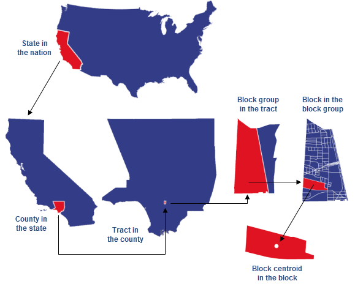
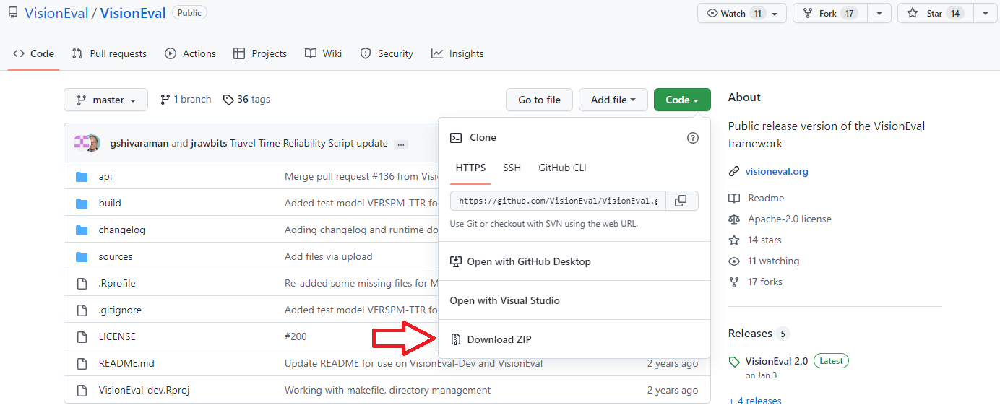
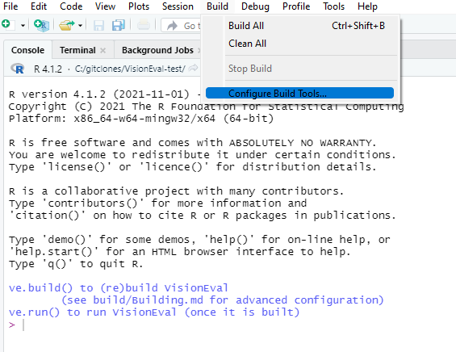
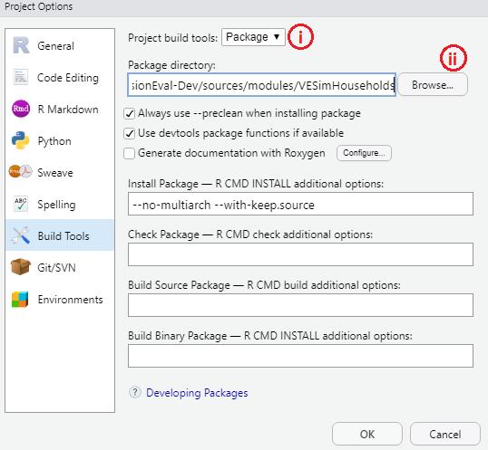
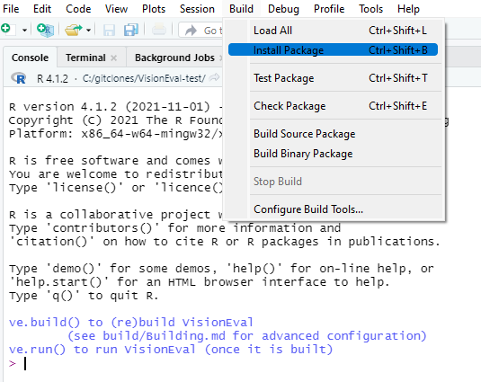

# Module Build Process {#ve-buildprocess}

```{r setup, include=FALSE}
knitr::opts_chunk$set(echo = TRUE, results='hide')
```

## Introduction

This chapter describes the package build process for creating or modifying packages and their constituent modules within the VisionEval framework. The build process can be used to incorporate localized or custom data into VE by making a change to a module and then rebuilding it. This chapter includes a simple case study example of substituting the default households population data with a locally-specific Public Use Microdata Sample (PUMS) from the US Census, and then rebuilding the package in VisionEval.

A summary of steps described are:

1.  Prerequisites: Installing R and RStudio.
2.  Install VisionEval environment.
3.  Install VisionEval package source.
4.  Replace data: Download data and place in the package source location.
5.  Package rebuild: Configure building and run package build.

## Context

The VisionEval "build process" rebuilds VisionEval packages to incorporate modified data in the module's model estimation and data processing steps in order to update data resources and estimated model coefficients. The reason that a modified module must be rebuilt before it is available for use in VisionEval is that VisionEval creates its own R environment with its own VisionEval modules built as R packages.

### What is an R "package"?

R is a community-based project and depends upon a community of re-usable, reproducible, and shareable code. To facilitate this, R uses a standardized method for bundling a collection of code and data into a built into a shareable binary "package". Packages can then be downloaded and installed into your local R environment.

#### Why is this relevant?

VisionEval relies on this fundamental package framework for inheriting code and data from its modules. Thus, in order to alter the data in a VisionEval module (i.e., an R Package) it must be repackaged, or re-built, using the new data. Otherwise, if only the source data is altered and not re-built, the VisionEval environment

#### VisionEval Environment vs Package Source

It is crucial for users to understand the distinction between the VisionEval *environment* code-base and the VisionEval *package source* code-base. In general, the latter is used build the former. More simply, VisionEval environment is the environment from where the models are run, drawing from the data and code built into the environment as R packages. This is an important distinction in the above steps #2 and #3.

### What are PUMS?

To summarize, the US Census Bureau provides anonymized data in two general forms:

-   **Aggregated census tables** - These tables provide the total or estimated counts by topic (e.g., total number of persons by age group). The smallest geographic unit are census blocks, but not all data are available at that level.

-   **Disaggregated PUMS** - A sample of individual record-level data for each person or household counted. (e.g., a persons age, gender, employment and the household they belong to.). The smallest geographic unit are Public Use Microdata Areas (PUMAs), which are aggregated areas to protect confidentiality and must include at least 100,000 persons.

Most people are at least somewhat familiar with the US Census and the information they collect. The primary function of the US Census is to collect a count of people living in the United States for federal allocation of political representatives and taxes. However, the US Census has since expanded to include a variety of other useful statistical information regarding demographics and employment. Census data are spatially organized into a hierarchy of sub-divided spatial areas, the smallest of which is called a Census Blocks, which aggregate into Block Groups, Tracts, Counties, and States. See the example figure below:

{width="480"}

The primary census program is the Decennial Census, which is a comprehensive count collected every 10 years. However, because populations can significantly change within a decade, the American Community Survey (ACS) was created to obtain data at more frequent intervals. Rather than a full census, the ACS collects ongoing samples on a monthly basis. These data are then used to publish statistically adjusted estimates in 1-year, 3-year, and 5-year estimates. 1-year estimates use the most recent data but are the least reliable because the sample is smaller, whereas the 5-year estimate uses data from the previous 5 years. Although not exactly equivalent, the 1- and 5-year estimates are often consider analogous with a 1% and 5% sample of the population.

The summary tables provide the total count of persons, but are aggregated, meaning that it only shows the total number of persons in each topic, but not the combination of topics. For example, we may know the count of people by age group, gender, occupation, and household size; but we do not know the count for a particular combination of those variables, or to which household they belong. For this reason, the US Census Bureau also releases what it calls a Public Use Microdata Sample (PUMS) using sample data from the ACS.

## Instructions

The following steps will be described in more detail below:

1.  Prerequisites: Installing R and RStudio.
2.  Install VisionEval environment.
3.  Install VisionEval package source.
4.  Replace data: Download data and place in the package source location.
5.  Package rebuild: Configure building and run package build.

#### 1. Install R and RStudio

R is a free software environment for statistical computing. On its own, R is an interpreted programming language executed using a command line interface, meaning the code does not need to be compiled. However, the R community has an integrated development environment (IDE) specific to R called RStudio (being renamed Posit in October 2022) which provides a user friendly graphical interface to allow users to develop and execute commands as well as to inspect and visualize the data as it is handled in R.

To install R and RStudio, users must first download and install R, and then download and install RStudio (R must be install for RStudio to function!)

-   R for windows can be downloaded here: <https://cran.rstudio.com/> (tested using R 4.1.2)

-   RStudio for windows can be downloaded here: <https://www.rstudio.com/products/rstudio/download/>

#### 2. Install VisionEval Environment

This zip file contains a pre-built standalone copy of VisionEval 2.0 for Windows (approx. 555MB file). It contains the entire VisionEval framework environment code, sample models, and all necessary R packages installed into the R VisionEval environment.

A. Download the [VE-2.0-Installer-Windows-R4.1.2_2022-01-03.zip](https://github.com/VisionEval/VisionEval/releases/download/public-2.0/VE-2.0-Installer-Windows-R4.1.2_2022-01-03.zip) from <https://visioneval.org/category/download.html>

B. Extract the entire contents of the zip file into a directory of your choice (e.g., `C:/Users/<user name>/Documents/VisionEval`) .

C. To start the VisionEval environment, navigate to this folder and double click `VisionEval.Rproj`.

Note: Advanced users may also Build VisionEval natively from source, but this process can take several hours. See VisionEval-Dev full model build %%%%LINK TO%%%%

#### 3. Download VisionEval source code

In the previous step, users have downloaded the pre-built VisionEval environment, but to make modifications to the package data users must re-build the packages from the source code.

-   Clone or "fork" a copy of the VisionEval from the Github repository (<https://github.com/VisionEval/VisionEval>).

-   If users are not familiar with [git](https://git-scm.com/downloads) and GitHub, simply download the repository as a zip file (<https://github.com/VisionEval/VisionEval/archive/refs/heads/master.zip>). In either case, the download is very large (over 900MB compressed and 3.4GB uncompressed as git clone).

-   In either case, extract the source code into a separate directory (e.g., `C:/Users/<user name>/Documents/VisionEval-Source`).

[{width="743"}](https://github.com/VisionEval/VisionEval/archive/refs/heads/master.zip)

#### 4. Replace data:

In this example we will be replacing the default PUMS data in the VESimHouseholds package with different local PUMS data. The source code for this package should be located in sources/modules folder of your source packages folder (e.g, `C:/Users/<user name>/Documents/VisionEval-source/sources/modules/VESimHouseholds`).

Packages will require the data to be in a certain format, and in this case the VESimHouseholds package requires two input data files `pums_households.csv` and `pums_persons.csv`.

*A) Download PUMS data*

US Census data are available from the Census' website (<https://www.census.gov/>), which provides an interface to search, browse, and download Census data in a variety of formats, the most typical being Comma Separated Value (CSV) files. PUMS data can be filtered using the Census data browser, or the entire PUMS tables for States can be downloaded from the legacy FTP website: <https://www2.census.gov/programs-surveys/acs/data/pums/>

The files are named according file type, (e.g., csv\_), record type ("h" for household or "p" for persons), and then the State abbreviation. For example, `"csv_haz.zip"` are household PUMS data for Arizona. Additional documentation can be found here: <https://www.census.gov/programs-surveys/acs/microdata/access.html>\

*B) Process PUMS data.*

VE was originally coded using an older PUMS file, which had slightly different field names and must be renamed. A name mapping key is in the table below:

| Table name              | VESimHouseholds field | New PUMS field | Description                               |
|-------------------------|-----------------------|----------------|-------------------------------------------|
| **pums_households.csv** | SERIALNO              | SERIALNO       | Housing/Group Quarters Unit Serial Number |
|                         | PUMA5                 | PUMA           | 5% Public Use Microdata Area code         |
|                         | HWEIGHT               | WGTP           | Housing unit weight                       |
|                         | UNITTYPE              | TYPEHUGQ       | Type of housing unit                      |
|                         | PERSONS               | NP             | Number of persons living in housing unit  |
|                         | BLDGSZ                | BLD            | Size of Building                          |
|                         | HINC                  | HINCP          | Household Total Income in 1999            |
| **pums_persons.csv**    | AGE                   | AGEP           | Age                                       |
|                         | WRKLYR                | WKL            | Worked in year                            |
|                         | MILITARY              | MIL            | In military                               |
|                         | INCTOT                | PINCP          | Person's total employment                 |

Depending on the file, other pre-processing may be required, such as removing NAs or converting categories. For example, missing NA values to 0 in HINC, shifting UNITYPE scale from {1,2,3} to {0,1,2}, or aggregating the 4-level WKL categories into 3-levels of WRKLYR. If these conversions are not made, issues may rrise in the package building step.

For a more detailed example of processing PUMS with example R scripts, see %%%%LINK TO ADVANCED INSTRUCTIONS %%%%

*C) Replace PUMS files*

Once processing is complete, replace the old files in your VisionEval [source]{.underline} package location with the the new `pums_households.csv` and `pums_persons.csv`. External data for VisionEval packages are typically located in the `inst/exdata` folder (e.g., `C:/Users/<user name>/Documents/VisionEval-source/sources/modules/VESimHouseholds/inst/extdata`) .

#### 5. Package building

The critical objective of re-building a package is to build a package ***from*** the package source ***to*** the VisionEval environment. To achieve this:

*A) Initialize the VisionEval Environment*

If not already started in Step 2C, start VisionEval environment by clicking the `VisionEval.Rproj` in the VisionEval *environment* directory (e.g., `C:/Users/<user name>/Documents/VisionEval`).

*B) Select Configure Build Tools from the Build menu*

{width="527"}

*C) Configure Build tools from the build menu*

i\. From "Project build tools", select "Package" from the drop-down.

ii\. For "Package directory", browse to your source package folder (e.g., `C:/Users/<user name>/Documents/VisionEval-source/sources/modules/VESimHouseholds`).

{width="507"}

Click OK. RStudio will flicker and restart.

*D) Install from package source*

If you want to test the new files before building it, you may run "Check Package" first.

Click the "Build" drop-down from the main banner menu again. This time there will be new options, select "Install Package".

{width="489"}

> NOTE: In some cases you may run into the error `ERROR: a 'NAMESPACE' file is required`.
>
> This is because newer versions of R (\>3.0.0) require a NAMESPACE file to point the package to any dependencies. As a workaround you must create a NAMESPACE file. You can either run "Check Package" from the build menu, this will run a suite of tests on the package and if possible, create any necessary files in a new folder called `VESimHouseholds.Rcheck/VESimHouseholds`.
>
> Or you can create the file manually with Notepad and paste following:
>
>     # Export all names
>     exportPattern(".")
>
>     # Import all packages listed as Imports or Depends
>     import(
>       visioneval
>     )
>
> Save the file as `"NAMESPACE"` [with the quotes]{.underline} in the VESimHouseholds folder. The quotes tells Windows not to add ".txt".

*E) Build again*

After one successful build, it is strongly recommended that you run build again. This is to ensure that the the new source data files have been generated and propagated through to the VisionEval environment as a package.

At this point the new data should now be imported and usable through the VESimHouseholds package. This can be tested by inspecting the data against the old using `VESimHouseholds::Hh_df`.
