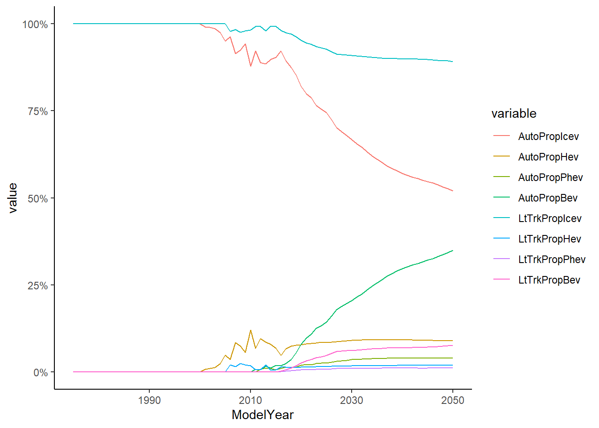
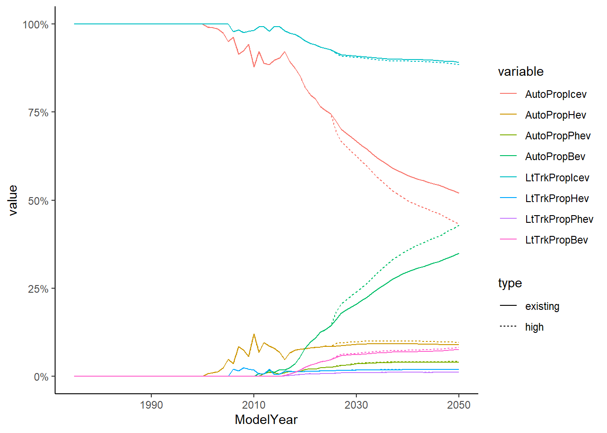

# VisionEval Module Build Process {#ve-buildprocess}

```{r setup, include=FALSE}
knitr::opts_chunk$set(echo = TRUE, results='hide')
```

## (Re)Building VisionEval

This chapter describes the build process for VisionEval. The VisionEval "build process" rebuilds VisionEval packages to incorporate modified data in the module's model estimation and data processing steps in order to update data resources and estimated model coefficients. The reason that a modified module must be rebuilt before it is available for use in VisionEval is that VisionEval creates its own R environment with its own VisionEval modules built as R packages.

### What is an R "package"?

R is a community-based project and depends upon a community of re-usable, reproducible, and shareable code. To facilitate this, R uses a standardized method for bundling a collection of code and data into a built into a shareable binary "package". Packages can then be downloaded and installed into your local R environment.

### Why is this relevant?

VisionEval relies on this fundamental package framework for inheriting code and data from its modules. Thus, in order to alter the data in a VisionEval module (i.e., an R Package) it must be repackaged, or re-built, using the new data. Otherwise, if only the source data is altered and not re-built, the VisionEval environment fails to recognize the updated data.

### How are packages built?

#### Environment vs Source

It is crucial for users to understand the distinction between the VisionEval *environment* code-base and the VisionEval *package source* code-base. In general, the latter is used build the former. More simply, VisionEval environment is the environment from where the models are run, drawing from the data and code built into the environment as R packages.

#### Build scope

To avoid confusion, it is important to first outline the difference between a full install build of VisionEval, and an individual package module build/re-build. This can become confusing when the term "build" is sometimes used interchangeable. At a high-level, building is explained as:

-   **Full install build:**

    A full build of all VisionEval packages will create a VisionEval runtime environment (i.e., the VisionEval framework) along with all VisionEval packages built into it. This is analogous to installing VisionEval on your machine. There are then two ways to perform a "full install build":

    (a) **Full Install Build Method (a): Downloading the pre-built zip** file and extracting it, or

    (b) **Full Install Build Method (b): Clone the source code** from GitHub using Git, then executing a full installation and build of all packages from the source code using RStudio and RTools.

    Option (b) is for more advanced "power users" and developers that are comfortable using Git, RTools, and writing R code. Option (a) is for typical end-users that simply want to install VisionEval and maybe modify a few package modules. The files in the pre-built zip are essentially the "built" directory generated using option (b).

-   **Individual package build:**

    An individual package module build is when a single VisionEval package is created/modified and is then installed (aka "built") into an *existing* VisionEval runtime environment that had been previously built in the above process. This is useful for creating and/or modifying packages and their constituent modules within the VisionEval framework. The build process can be used to incorporate localized or custom data into VE by making a change to a module and then rebuilding it.

#### Full Build Instructions

##### Install R and RStudio

To begin, you must have R and RStudio installed. R is a free software environment for statistical computing. On its own, R is an interpreted programming language executed using a command line interface, meaning the code does not need to be compiled. However, the R community has an integrated development environment (IDE) specific to R called RStudio (being renamed Posit in October 2022, see <https://posit.co/>) which provides a user friendly graphical interface to allow users to develop and execute commands as well as to inspect and visualize the data as it is handled in R.

To install R and RStudio, users must first download and install R, and then download and install RStudio (**note**: R must be installed for RStudio to function!)

-   R for windows can be downloaded here: <https://cran.rstudio.com/> *(Tested using 4.1.2). It is suggested to use an R version that aligns with the VE R version. The Cran website includes links to past versions although the most current is the one often highlighted on the first page.*

-   RStudio for windows can be downloaded here: <https://www.rstudio.com/products/rstudio/download/>

##### Method (a): Pre-build VisionEval Installer

This is a zip file contains a pre-built standalone copy of VisionEval 3.0 for Windows (approx. 585MB file). It contains the entire VisionEval framework environment code, sample models, and all necessary R packages installed into the R VisionEval environment.

1.  Download the [VE-3.0-Installer-Windows-R4.1.3_2022-05-27.zip](https://github.com/VisionEval/VisionEval-Dev/releases/download/beta-release-0.9/VE-3.0-Installer-Windows-R4.1.3_2022-05-27.zip) from <https://visioneval.org/category/download.html>

2.  Extract the entire contents of the zip file into a directory of your choice (e.g., `C:/Users/<user name>/Documents/VisionEval`).

3.  To start VisionEval, double click the `VisionEval.RProj` file in the directory just created.

    {width="454"}

That's it, you are done installing a full build of the VisionEval environment!

The `ve-lib` directory is the VisionEval package library that contains all installed packages and VisionEval modules.

##### Method (b): Local-built VisionEval from source code

Advanced users may want to build VisionEval natively from the source code for development or on non-Windows computers. This process can take several hours. For more details, see instruction in [build/Building.md](https://github.com/VisionEval/VisionEval/blob/master/build/Building.md).

1.  Install [RTools](https://cran.r-project.org/bin/windows/Rtools/rtools42/rtools.html). The easiest way is to download and run the RTools windows install. RTool4.0 has been tested, but [RTool4.2](https://cran.r-project.org/bin/windows/Rtools/rtools42/files/rtools42-5355-5357.exe) should also work.

2.  Clone or "fork" a copy of the VisionEval from the Github repository (<https://github.com/VisionEval/VisionEval>) into a directory of your choice (e.g., `C:/Users/<user name>/Documents/VisionEval-Source`) using:

    `git clone git@github.com:VisionEval/VisionEval.git VisionEval-Source`

    -   For developers, there is a separate development repository with the latest unreleased source code: <https://github.com/VisionEval/VisionEval-Dev>

    -   Users not familiar with [git](https://git-scm.com/downloads) and GitHub can simply download the repository as a zip file (<https://github.com/VisionEval/VisionEval/archive/refs/heads/master.zip>). In either case, the download is very large (over 900MB compressed download and 3.4GB uncompressed on disk). The Zip file download is shown in the figure below.

        [{width="743"}](https://github.com/VisionEval/VisionEval/archive/refs/heads/master.zip)

3.  Start VisionEval by double clicking the VisionEval.RProject file in the newly cloned `VisionEval-Source` directory.

4.  Start the build process by entering `ve.build()` into the console. This will start the process of downloading and installing every R package required by VisionEval as well as installing the VisionEval framework specific packages. The output will look something like this:

    {width="431"}

    This will take a while, potentially over an hour. Once completed, you've successfully performed a full build install of the VisionEval runtime environment.

5.  A new folder called 'built' will be created your source directory, populated with a sub-folder for the R-version you used to build VisionEval with:\
    `VisionEval-Source\built\visioneval\<your R version number e.g., 4.1.2>\`

    This will contain a few key folders:

    -   `src`: The VisionEval package source.

    -   `ve-lib`: The package library containing all built and installed R packages.

    -   `runtime`: The built model runtime.

## Common use cases

This chapter includes a two common use cases:

1.  The first case study example is substituting the default households population data with a locally-specific US Census data Public Use Microdata Sample (PUMS) - a valuable way to get your VE model to reflect local conditions - and then rebuilding the individual package in VisionEval.

2.  The second case study example instead defines a custom function which alters the default data values as they are read into VisionEval during the build process.

## Case Study 1: Using local PUMS data

### What are PUMS?

To summarize, the US Census Bureau provides anonymized data in two general forms:

-   **Aggregated census tables** - These tables provide the total or estimated counts by topic (e.g., total number of persons by age group). The smallest geographic unit are census blocks, but not all data are available at that level.

-   **Disaggregated PUMS** - A sample of individual record-level data for each person or household counted. (e.g., a persons age, gender, employment and the household they belong to.). The smallest geographic unit are Public Use Microdata Areas (PUMAs), which are aggregated areas to protect confidentiality and must include at least 100,000 persons.

Most people are at least somewhat familiar with the US Census and the information they collect. The primary function of the US Census is to collect a count of people living in the United States for federal allocation of political representatives and taxes. However, the US Census has since expanded to include a variety of other useful statistical information regarding demographics and employment. Census data are spatially organized into a hierarchy of sub-divided spatial areas, the smallest of which is called a Census Blocks, which aggregate into Block Groups, Tracts, Counties, and States. See the example figure below:

{alt="Example Census geographic hierarchy" width="480"} *source: US Census*

The primary census program is the Decennial Census, which is a comprehensive count collected every 10 years. However, because populations can significantly change within a decade, the American Community Survey (ACS) was created to obtain data at more frequent intervals. Rather than a full census, the ACS collects ongoing samples on a monthly basis. These data are then used to publish statistically adjusted estimates in 1-year, 3-year, and 5-year estimates. 1-year estimates use the most recent data but are the least reliable because the sample is smaller, whereas the 5-year estimate uses data from the previous 5 years. Although not exactly equivalent, the 1- and 5-year estimates are often consider analogous with a 1% and 5% sample of the population.

The summary tables provide the total count of persons, but are aggregated, meaning that it only shows the total number of persons in each topic, but not the combination of topics. For example, we may know the count of people by age group, gender, occupation, and household size; but we do not know the count for a particular combination of those variables, or to which household they belong. For this reason, the US Census Bureau also releases what it calls a Public Use Microdata Sample (PUMS) using sample data from the ACS.

The generalized approach to updating data within a VE package is set out below.

### Instructions

#### Step 1) Start VisionEval environment

To start the VisionEval environment, navigate to your VisionEval environment folder (e.g., `C:/Users/<user name>/Documents/VisionEval`) and double click `VisionEval.Rproj`.

#### Step 2) Gather PUMS and replace data:

In this example we will be replacing the default PUMS data in the VESimHouseholds package with your project specific local PUMS data. The source code for this package should be located in sources/modules folder of your source packages folder (e.g, `C:/Users/<user name>/Documents/VisionEval-source/sources/modules/VESimHouseholds`).

Packages will require the data to be in a certain format, and in this case the VESimHouseholds package requires two input data files `pums_households.csv` and `pums_persons.csv`.

##### *A) Download PUMS data*

US Census data are available from the Census' website (<https://www.census.gov/>), which provides an interface to search, browse, and download Census data in a variety of formats, the most typical being Comma Separated Value (CSV) files. PUMS data can be filtered using the Census data browser, or the entire PUMS tables for States can be downloaded from the legacy FTP website: <https://www2.census.gov/programs-surveys/acs/data/pums/>

The files are named according file type, (e.g., csv\_), record type ("h" for household or "p" for persons), and then the State abbreviation. For example, `"csv_haz.zip"` are household PUMS data for Arizona. Additional documentation can be found here: <https://www.census.gov/programs-surveys/acs/microdata/access.html>

##### *B) Process PUMS data.*

VE was originally coded using an older PUMS file, which had slightly different field names and <u>must be renamed</u>. A name mapping key is in the table below:

| Table name              | VESimHouseholds field | New PUMS field | Description                               |
|-----------------|-----------------|-----------------|--------------------|
| **pums_households.csv** | SERIALNO              | SERIALNO       | Housing/Group Quarters Unit Serial Number |
|                         | PUMA5                 | PUMA           | 5% Public Use Microdata Area code         |
|                         | HWEIGHT               | WGTP           | Housing unit weight                       |
|                         | UNITTYPE              | TYPEHUGQ       | Type of housing unit                      |
|                         | PERSONS               | NP             | Number of persons living in housing unit  |
|                         | BLDGSZ                | BLD            | Size of Building                          |
|                         | HINC                  | HINCP          | Household Total Income in 1999            |
| **pums_persons.csv**    | AGE                   | AGEP           | Age                                       |
|                         | WRKLYR                | WKL            | Worked in year                            |
|                         | MILITARY              | MIL            | In military                               |
|                         | INCTOT                | PINCP          | Person's total employment                 |

Depending on the file, other pre-processing may be required, such as removing NAs or converting categories. For example, missing NA values to 0 in HINC, shifting UNITYPE scale from {1,2,3} to {0,1,2}, or aggregating the 4-level WKL categories into 3-levels of WRKLYR. If these conversions are not made, issues may rrise in the package building step.

##### *C) Replace PUMS files*

Once processing is complete, replace the old files in your VisionEval package location with the the new `pums_households.csv` and `pums_persons.csv`. External data for VisionEval packages are typically located in the `inst/exdata` folder (e.g., `C:/Users/<user name>/Documents/VisionEval-source/sources/modules/VESimHouseholds/inst/extdata`) .

#### Step 3) Package building

The critical objective of re-building a package is to build a package ***from*** the package source ***to*** the VisionEval environment. This guide uses the RStudio interface. To achieve this:

##### *A) Initialize the VisionEval Environment*

If not already started in Step 3, start VisionEval environment by clicking the `VisionEval.Rproj` in the VisionEval *environment* directory (e.g., `C:/Users/<user name>/Documents/VisionEval`).

##### *B) Select Configure Build Tools from the Build menu* (image shows an RStudio window)

{width="527"}

##### *C) Configure Build tools from the build menu*

i\. From "Project build tools", select "Package" from the drop-down.

ii\. For "Package directory", browse to your source package folder (e.g., `C:/Users/<user name>/Documents/VisionEval-source/sources/modules/VESimHouseholds`).

{width="507"}

Click OK. RStudio will flicker and restart.

##### *D) Install from package source*

Click the "Build" drop-down from the main banner menu again. This time there will be new options, select "Install Package".

{width="489"}

##### *E) Build again*

After one successful build, you must run build again to ensure that the the new source data files have been (1) generated and (2) the new data files have propagated through to the VisionEval environment as a package.

**Done!**

This this point the new data should now be imported and usable through the VESimHouseholds package. This can be tested by inspecting the data against the old using `VESimHouseholds::Hh_df`.

------------------------------------------------------------------------

## Case Study 2: VEPowertrainsandFuels

This case study explores the challenge of modifying the <u>package code itself rather than only the data</u>. The objective of this case study is to define a custom function which alters the default data values as they are read into VisionEval during the build process.

This section walks users through modifying the data as they are read in to VisionEval. Before modifying the code, a brief analysis is conducted to define a modifying function and demonstrate the effects if the modifications. The next subsection utilizes the function in the `LoadDefaultValues.R` script to modify `hh_powertrain_prop.csv` as the data are read in.

**Note**: The same results of this case study can be achieved by simply modifying the `hh_powertrain_prop.csv` input file, but the code itself will be modified for demonstration. However, this input file needs the package to be 'rebuilt' in order to take effect in the VE model run. Return to Step 5 above to review the **build process** again after modifying the data.

### 1. Data

`VEPowertrainsAndFuels\inst\extdata\hh_powertrain_prop.csv` are the default powertrain proportions contained in the package, which resembles the table below (the table is compressed to select years for clarity). The file's purpose is to provide the proportion of vehicle powertrain types by vehicle type (auto and light trucks) and vehicle vintage year.

| ModelYear | AutoPropIcev | AutoPropHev | AutoPropPhev | AutoPropBev | LtTrkPropIcev | LtTrkPropHev | LtTrkPropPhev | LtTrkPropBev |
|--------|--------|--------|--------|--------|--------|--------|--------|--------|
| 1975      | 1            | 0           | 0            | 0           | 1             | 0            | 0             | 0            |
| 2000      | 1            | 0           | 0            | 0           | 1             | 0            | 0             | 0            |
| 2010      | 0.8786       | 0.1213      | 0            | 0.0001      | 0.9820        | 0.0180       | 0             | 0            |
| 2020      | 0.8212       | 0.0788      | 0.0202       | 0.0798      | 0.9524        | 0.0143       | 0.0067        | 0.0266       |
| 2030      | 0.6676       | 0.0908      | 0.0358       | 0.2058      | 0.9093        | 0.0179       | 0.0106        | 0.0622       |
| 2040      | 0.5701       | 0.0922      | 0.0403       | 0.2974      | 0.8996        | 0.0191       | 0.0114        | 0.0698       |
| 2050      | 0.5198       | 0.0895      | 0.0407       | 0.3500      | 0.8916        | 0.0193       | 0.0119        | 0.0772       |

The table contains two powertrain proportions, the left-most four columns are for automobiles (i.e., `AutoProp`) and the right-most are for light trucks (i.e., `LtTrkProp`). Each will sum up to 1 (for a rowsum of 2).

### 2. Analysis

To begin, the code snippets below conduct a brief exploratory analysis to demonstrate visually what the data look like and how they will be modified. Using some helper packages `ggplot2` and `reshape` we can format the data for visualization. **Note:** These packages are not necessary for modifying the data in VisionEval, but are used for formatting and plotting in this case study.

    # Additional packages
    library(ggplot2)
    library(reshape)

    # Load data, uncomment it to run in your project
    hh_powertrain_prop <- read.csv('.YOUR_PACKAGE_DIRECTORY/inst/extdata/hh_powertrain_prop.csv')

    melted_powertrains <- reshape::melt(hh_powertrain_prop, id.vars = 'ModelYear')

    ggplot(data = melted_powertrains) +
      geom_line(aes(x=ModelYear, y=value, color=variable)) +
      scale_y_continuous(labels=scales::percent) +
      theme_classic()

{alt="Household Powertrain Proportions" width="75%"}

We can see that battery electric vehicles (BEV), specifically automobiles, are projected to make up the majority of vehicles bought in future years. This causes the share of internal combustion engine to decline proportionally.

Let us assume that the state government is deciding whether to aggressively promote BEV cars starting in 2025. The policies cause the share of alternative powertrains (BEV, HEV, and PHEV) to increase more over time. To model this increase, we will use an arbitrary function which adds to the current value of $x$ (i.e., the proportion) at a quadratic rate.

$$
f(x) = x + x^2 (1 - x)
$$ We then create a wrapper function that adjusts each of the alternative powertrains using our custom modeling function. To ensure that the proportions sum up to 1 for autos and light trucks, respectively, we then calculate the remaining proportion of ICE powertrains by subtracting the proportion of alternative powertrains.

    # Wrapper function to adjust the powertrain data
    adjust_powertrain <- function(powertrain_df, start_year) {
      # Define our adjustment functions
      adj_fun <- function(xv) xv + (xv^2) * (1 - xv)

      # Which columns to modify
      cols <- colnames(powertrain_df)
      ev_cols <- cols[grepl('Hev|Phev|Bev', cols)]
      ice_cols <- cols[grepl('Icev', cols)]

      # Create the modified data frame
      df_mod <- powertrain_df
      yrs_idx <- df_mod$ModelYear > start_year

      # Adjust the alternate powertrain data (BEV, PHEV, HEV) data
      df_mod[yrs_idx, ev_cols] <- apply(powertrain_df[yrs_idx, ev_cols], 2, adj_fun)

      # Subtract the amount of remaining internal combustion engines (ICE)
      for(x in ice_cols){
        sum_cols <- ev_cols[grepl(gsub('Icev', '', x), ev_cols)]
        df_mod[yrs_idx, eval(x)] <- 1 - rowSums(df_mod[yrs_idx, sum_cols])
      }

      return(df_mod)
    }

The adjusted inputs can be combined with the existing data. The combined plot shows an noticeable increase in alternative powertrain vehicle shares for later vintage years.

    hh_powertrain_prop_high <- adjust_powertrain(hh_powertrain_prop, 2025)

    melted_powertrains <- rbind(
      cbind(reshape::melt(hh_powertrain_prop, id.vars = 'ModelYear'), type='existing'),
      cbind(reshape::melt(hh_powertrain_prop_high, id.vars = 'ModelYear'), type='high')
      )

    ggplot(data = melted_powertrains) +
      geom_line(aes(x=ModelYear, y=value, color=variable, linetype=type)) +
      scale_y_continuous(labels=scales::percent) +
      theme_classic()

{alt="Adjusted Household Powertrain Proportions" width="75%"}

### 3. Function modification

Once a model user is satisfied with the effects that are represented by applying the modifying function, the `LoadDefaultValues.R` can be edited to include the function. Beginning on line #422, the R script initializes the household powertrain datastore input, then loads in the CSV file using `processEstimationInputs`. We can insert the new function after the data has been loaded but before it has been stored and cleaned up at `PowertrainFuelDefaults_ls$HhPowertrain_df <- HhPowertrain_df`.

    #----------------------------------------
    #Household vehicle powertrain proportions
    #----------------------------------------
    #Specify input file attributes
    Inp_ls <- items(
      item(
        NAME = "ModelYear",
        TYPE = "integer",
        PROHIBIT = c("NA", "< 0"),
        ISELEMENTOF = "",
        UNLIKELY = "",
        TOTAL = ""
      ),
      item(
        NAME =
          items("AutoPropIcev",
                "AutoPropHev",
                "AutoPropPhev",
                "AutoPropBev",
                "LtTrkPropIcev",
                "LtTrkPropHev",
                "LtTrkPropPhev",
                "LtTrkPropBev"),
        TYPE = "double",
        PROHIBIT = c("NA", "< 0", "> 1"),
        ISELEMENTOF = "",
        UNLIKELY = "",
        TOTAL = ""
      )
    )
    #Load and process data
    HhPowertrain_df <-
      processEstimationInputs(
        Inp_ls,
        "hh_powertrain_prop.csv",
        "LoadDefaultValues.R")
    #Check whether all years are present
    Years_ <- 1975:2050
    if (!all(Years_ %in% HhPowertrain_df$ModelYear)) {
      stop(paste(
        "File 'hh_powertrain_prop.csv' must have values for at least the years",
        "from 1975 through 2050", sep = " "))
    }
    #Check that powertrain proportion are 0 when powertrain characteristics are NA
    Msg_ <- character(0)
    for (ty in c("Auto", "LtTrk")) {
      for (pt in c("Icev", "Hev", "Phev", "Bev")) {
        PtType <- paste0(ty, pt)
        PropName <- paste0(ty, "Prop", pt)
        CharName <- paste0(ty, pt, "Mpg")
        if (pt == "Bev") CharName <- paste0(ty, pt, "Mpkwh")
        Prop_ <- HhPowertrain_df[[PropName]]
        Char_ <- PowertrainFuelDefaults_ls$LdvPowertrainCharacteristics_df[[CharName]]
        if (any(Prop_[is.na(Char_)] != 0)) {
          Msg <- paste0(
            "hh_powertrain_prop.csv file error. Non-zero proportion(s) for ",
            PropName, " where NA values in ldv_powertrain_characteristics.csv for ",
            CharName)
          Msg_ <- c(Msg_, Msg)
        }
      }
    }
    if (length(Msg_) != 0) {
      stop(paste(Msg_, collapse = ", "))
    }

    #>>>>>>>>> NEW FUNCTION BEGINS
    adjust_powertrain <- function(powertrain_df, start_year) {
      # Define our adjustment functions
      adj_fun <- function(xv) xv + (xv^2) * (1 - xv)

      # Which columns to modify
      cols <- colnames(powertrain_df)
      ev_cols <- cols[grepl('Hev|Phev|Bev', cols)]
      ice_cols <- cols[grepl('Icev', cols)]

      # Create the modified data frame
      df_mod <- powertrain_df
      yrs_idx <- df_mod$ModelYear > start_year

      # Adjust the alternate powertrain data (BEV, PHEV, HEV) data
      df_mod[yrs_idx, ev_cols] <- apply(powertrain_df[yrs_idx, ev_cols], 2, adj_fun)

      # Subtract the amount of remaining internal combustion engines (ICE)
      for(x in ice_cols){
        sum_cols <- ev_cols[grepl(gsub('Icev', '', x), ev_cols)]
        df_mod[yrs_idx, eval(x)] <- 1 - rowSums(df_mod[yrs_idx, sum_cols])
      }

      return(df_mod)
    }

    #<<<<<<<<< END OF NEW FUNCTION

    #Add to PowertrainFuelDefaults_ls and clean up
    PowertrainFuelDefaults_ls$HhPowertrain_df <- HhPowertrain_df
    rm(Inp_ls, HhPowertrain_df)

### 4. Build

The previous step generated the R data files, and you will need to re-build and re-install the VEPowertrainsAndFuels package for VisionEval to use this new input data.

Any of the build processes described above can be used.

Once the package re-build is complete, your new powertrain data will be ready to use in a VisionEval model run.

## Advanced Build Process

This sections contains miscellaneous information that may be useful for more advanced users.

1.  VisionEval Package Structure
2.  Build from command line
3.  PUMS data processing helper scripts
4.  Modifying package code

### VisionEval Package Structure

VisionEval packages will generally have a structure similar to the following:

    source/modules/VEGenericPackage
    ├───data
    │   ├─ GenericPackageSpecifications.rda
    │   ├─ GenericPackage_df.rda
    │   └─ GenericPackage_ls.rda
    ├───R
    │   ├─ CreateEstimationDatasets.R
    │   └─ GenericModel.R
    └───inst
        └─ extdata
            ├─ input_data1.csv
            └─ input_data2.txt

-   `inst\extdata` is where "external" input data sources and reference files will be placed

-   The `R` directory contains any R scripts used in the packages. These must be independent non-sequential scripts that do not depend on results from other scripts.

-   `data` contains the resulting data that VisionEval generates and utilizes.

-   `man` and `inst\module_docs`, contain the markdown documentation generated during the build process.

### Build from command line

While the GUI method is intuitive, it can be convenient to simply execute a build command from a generic R session rather than navigating menu trees in the GUI.

The fundamental command to build an r package can be run from R console using `system("R CMD INSTALL package_path -l lib_path")`. The GUI method essentially constructs this command and executes it.

-   `package_path` is the path to the package you are building. If your working directory is already located in the package, you can use `.` to denote the local directory.
-   `lib_path` is the runtime environment, in this case the VisionEval environment:

<!-- -->

    system("R CMD INSTALL "C:\Users\<user name>\Documents\VisionEval-source\sources\modules\VESimHouseholds" -l "C:\Users\<user name>\Documents\VisionEval\ve-lib")

### PUMS data processing helper scripts

Processing PUMS data can be challenging for two reasons.

1.  PUMS data evolves, with some field names and levels changing.
2.  The 2000 PUMS are stored in a compressible serial text file structure, rather a common delimited file (e.g., CSV), making importing tedious.

Below are some helper scripts for future users to build upon:

NOTE: These may not work with all PUMS file years, operating systems, or R versions. Best effort was made to identify weak points (e.g., unzipping), but cannot be guaranteed. These scripts are meant to be a resource to you as a starting point, not a production level code.

### PUMS File import and header processing

``` r
# IMPORTS
library(data.table)
library(tools)


# Function to process PUMS as it is read in
process_acs_pums <- function(PumsFile, type, GetPumas='ALL') {
  # ACS PUMS to legacy Census PUMS fields
  # Make any modifications here as necessary
  meta = list(
    'h' = list(
      SERIALNO = list(acsname = 'SERIALNO', class ='character'),
      PUMA5 = list(acsname='PUMA', class='character'),
      HWEIGHT = list(acsname='WGTP', class='numeric'),
      UNITTYPE = list(acsname='TYPE', class='numeric'),
      PERSONS = list(acsname='NP', class='numeric'),
      BLDGSZ = list(acsname='BLD', class='character'),
      HINC = list(acsname='HINCP', class='numeric')
    ),
    'p' = list(
      SERIALNO = list(acsname = 'SERIALNO', class ='character'),
      AGE = list(acsname='AGEP', class='numeric'),
      WRKLYR = list(acsname='WKL', class='character'),
      MILITARY = list(acsname='MIL', class='numeric'),
      INCTOT = list(acsname='PINCP', class='numeric')
    )
  )
  
  colNames <- lapply(meta, function(x) sapply(x, function(y) y[['acsname']]))
  colclass <- lapply(meta, function(x) sapply(unname(x), function(y) {
    setNames(y[['class']], y[['acsname']])
  }))
  
  
  
  if(Sys.info()['sysname'] == 'Windows') {
    cmd <- paste0("unzip -p '", PumsFile, "'")
  }
  
  if(Sys.info()['sysname'] == 'Linux') {
    cmd <- paste0("gunzip -cq '", PumsFile,"'")
  }
  
# Checks if it is a zip file or a bytefile
  if(grepl('.zip', PumsFile)) {
    df <- fread(cmd = cmd, 
                select = names(colclass[[type]]),
                colClasses = colclass[[type]])
  } else {
    df <- fread(PumsFile,
                select = names(colclass[[type]]),
                colClasses = colclass[[type]])
  }
  
  # Rename ACS PUMS fields to match legacy Census PUMS fields
  setnames(df, colNames[[type]], names(colNames[[type]]))
  
  return(df)
}

process_2000_pums <- function(PumsFile, GetPumas='ALL') {
  #Read in file and split out household and person tables
  Pums_ <- readLines(PumsFile)
  RecordType_ <- 
    as.vector(sapply(Pums_, function(x) {
      substr(x, 1, 1)
      }))
  H_ <- Pums_[RecordType_ == "H"]
  P_ <- Pums_[RecordType_ == "P"]
  rm(Pums_, RecordType_, PumsFile)
  
  #Define a function to extract specified PUMS data and put in data frame
  extractFromPums <- 
    function(Pums_, Fields_ls) {
      lapply(Fields_ls, function(x) {
        x$typeFun(unlist(lapply(Pums_, function(y) {
          substr(y, x$Start, x$Stop)
        })))
      })
    }
  
  #Identify the housing data to extract
  HFields_ls <-
    list(
      SERIALNO = list(Start = 2, Stop = 8, typeFun = as.character),
      PUMA5 = list(Start = 19, Stop = 23, typeFun = as.character),
      HWEIGHT = list(Start = 102, Stop = 105, typeFun = as.numeric),
      UNITTYPE = list(Start = 108, Stop = 108, typeFun = as.numeric),
      PERSONS = list(Start = 106, Stop = 107, typeFun = as.numeric),
      BLDGSZ = list(Start = 115, Stop = 116, typeFun = as.character),
      HINC = list(Start = 251, Stop = 258, typeFun = as.numeric)
    )
  
  #Extract the housing data and clean up
  H_df <- data.frame(extractFromPums(H_, HFields_ls), stringsAsFactors = FALSE)
  #Extract records for desired PUMAs
  if (GetPumas[1] != "ALL") {
    H_df <- H_df[H_df$PUMA5 %in% GetPumas,]
  }

  #Identify the person data to extract
  PFields_ls <-
    list(
      SERIALNO = list(Start = 2, Stop = 8, typeFun = as.character),
      AGE = list(Start = 25, Stop = 26, typeFun = as.numeric),
      WRKLYR = list(Start = 236, Stop = 236, typeFun = as.character),
      MILITARY = list(Start = 138, Stop = 138, typeFun = as.numeric),
      INCTOT = list(Start = 297, Stop = 303, typeFun = as.numeric)
    )
  
  #Extract the person data and clean up
  P_df <- data.frame(extractFromPums(P_, PFields_ls), stringsAsFactors = FALSE)
  #If not getting data for entire state, limit person records to be consistent
  if (GetPumas[1] != "ALL") {
    P_df <- P_df[P_df$SERIALNO %in% unique(H_df$SERIALNO),]
  }

  return( list('p' = P_df, 'h' = H_df) )
}
```

### PUMS data web-scraping

This has been automated one step further by scraping the data and running the above functions on the files as they are read in.

``` r

# Downloads and processes legacy 2000 PUMS data
getDecPUMS <- function(STATE, output_dir = NA){
  #VARS
  state_codes <- fread('state.txt')
  state_codes <- setNames(state_codes$STATE, state_codes$STUSAB)
  base_url = 'https://www2.census.gov/census_2000/datasets/PUMS/FivePercent'
  
  if(length(STATE) > 2 & !is.numeric(STATE)) {
    STATE <- state.abb[match(toTitleCase(STATE),state.name)]
  }
  STATE_NAME <- state.name[match(toupper(STATE),state.abb)]
  
  
  if(!is.numeric(STATE)) STATE_NUM <- state_codes[toupper(STATE)]
  
  
  # Download the PUMS data to tempfile and load directly to data table
  url <- file.path(base_url,
                   STATE_NAME,
                   paste0('REVISEDPUMS5_', sprintf("%02d", STATE_NUM), '.TXT'))
  
  temp <- tempfile()
  download.file(url, temp)
  
  # Read .txt to data frames
  PUMS <- process_2000_pums(temp)
  
  # SAVE OUTPUT
  if(!is.na(output_dir)) {
    if(!dir.exists(output_dir)) dir.create(output_dir)
    fwrite(PUMS[['p']], file.path(output_dir, 'pums_persons.csv'))
    fwrite(PUMS[['h']], file.path(output_dir, 'pums_households.csv'))
  } else {
    return(PUMS)
  }
}

# Downloads and processes post-2000 PUMS
getACSPUMS <- function(STATE, YEAR='2000', GetPumas='ALL', output_dir, save_zip = T){
  #VARS
  try({
    state_codes <- fread('state.txt')
    state_codes <- setNames(state_codes$STATE, state_codes$STUSAB)
    })
  base_url = 'https://www2.census.gov/programs-surveys/acs/data/pums'
  
  
  if(length(STATE) > 2 & !is.numeric(STATE)) {
    STATE <- tolower(state.abb[match(toTitleCase(STATE),state.name)])
  }
  
 
  # Download the PUMS data to tempfile and load directly to data table
  PUMS <- lapply(c('p', 'h'), function(f) {
    url <- file.path(base_url, YEAR, '5-Year',
                     paste0('csv_', f, tolower(STATE), '.zip'))
    
    if(save_zip == F){
      temp <- tempfile()
    } else {
      temp <- file.path(output_dir, basename(url))
    }
    
    download.file(url, temp)
    df <- process_acs_pums(temp, type=f, GetPumas)
  
    return(df)
  })
  names(PUMS) <- c('p', 'h')
  
  
  # SAVE OUTPUT
  if(!is.na(output_dir)) {
    if(!dir.exists(output_dir)) dir.create(output_dir)
    fwrite(PUMS[['p']], file.path(output_dir, 'pums_persons.csv'))
    fwrite(PUMS[['h']], file.path(output_dir, 'pums_households.csv'))
  } else {
    return(PUMS)
  }
}
```
