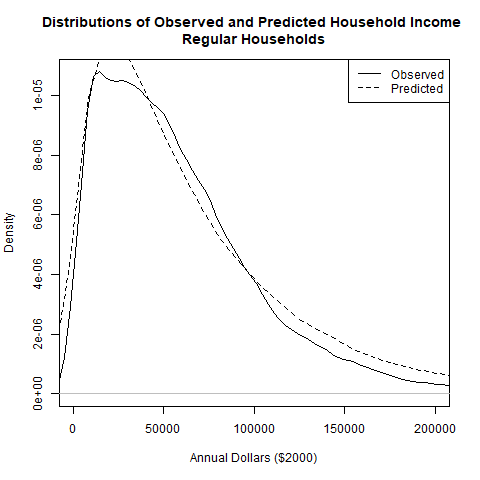
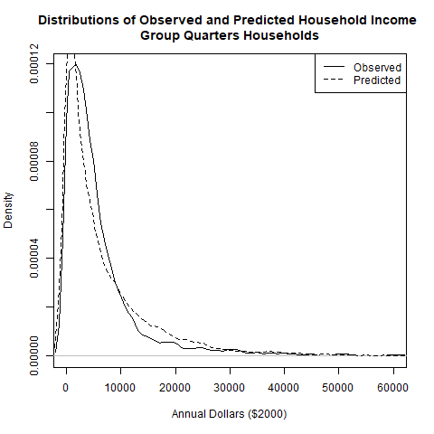

# Customizable household data using Population Sim {#ve-popsim}

## Introduction

This chapter introduces the option for users of VisionEval models to incorporate third-party synthetic population data produced by software tools. Examples being PopulationSim (https://activitysim.github.io/populationsim/#) and UrbanSim (https://urbansim.com/). The synthetic population is developed in the VESimHouseholds module within VisionEval. This module can be amended to use the third party data. The following sections describe the process for using this data. 

The approach for using synthetic data is different depending on whether you already have a synthetic population or VisionEval. 

For users of existing synthetic data looking to setup a VisionEval model:

- This process requires the VisionEval is setup with an identical geography as the population data. 
- The VisionEval model requires several inputs at specific geographic levels. 

For users of an existing VisionEval model looking to use synthetic data:

- This process requires the synthetic data to adopt the same geographies as the VisionEval model.
- The VisinEval model will already have all the data for the various geographies. The synthetic population will have be run with these specific geographies in order to consistently align the data.

The scripts below focus on the second use case where there is an existing operational VisionEval model that will be amended to make use of a new synthetic population that will replace the existing synthetic household population process within VisionEval. The VisionEval model will have an updated module that will use pre-processed data and transform that data to work within the VisionEval specifications. 

This chapter will provide a tool to do the pre-processing as well provide the revised run scripts to run the new synthetic population VisionEval module.


## Overview

This documentation describes the VESimHouseholds package. The purpose is to orient users to the mechanics of the VESimHouseholds package and thoroughly describe its inputs and outputs so that users can implement the package using customizable local data.

One of the basic components of VisionEval is the household population being modeled. This population contains key demographic attributes for transportation modeling, such as age, income, employment, and household composition (i.e., the types of persons in each household). A common challenge in transportation modeling is high-dimensional data. As variables are added, the database grows exponentially. Since VisionEval is intended to be lightweight, it only includes a minimum of demographic features associated with key travel behavior parameters. However, it is important to empower users to incorporate additional variables specific to their needs.

This guide is divided into two main sections:

1. **VESimHouseholds** package inputs, mechanics, and outputs are described. Within this section is a description of the individual modules used in the package and their contribution to the [final household population data](#VESimHouseholds-output). The specific modules are:
   - [CreateEstimationDatasets](#CreateEstimationDatasets)
   - [CreateHouseholds](#CreateHouseholds)
   - [PredictWorkers](#PredictWorkers)
   - [AssignLifeCycle](AssignLifeCycle)
   - [PredictIncome](#PredictIncome)

2. [**PopulationSim**](#PopulationSim) inputs, mechanics, and outputs are described for use as a third-party population synthesizer.

**Note**: It is important to clarify that population data and household characteristics appended to the population are for post-processing analysis, and do not introduce changes to travel behavior models. Additionally, the conversion tool from external population synthesis <u>to be developed</u> will not forecast shifts in demographic characteristics (aside from age, income, employment status).

## A Primer on Population Synthesis
Population synthesis is essentially the process of expanding by replication a small disaggregated data sample (i.e., one record per household), called "seed data", to match aggregated total population counts. The challenge is that the sample data is almost never a perfectly proportional sample. When the sample data is expanded to match one variable, it typically will cause the other variables to become poorly fit. To mitigate this, population synthesis iteratively fits each variable until the total error is minimized. An additional challenge in population synthesis is in handling multilevel data with both individual persons and households that contain persons. Matching all target total counts with that many degrees of freedom can be difficult and computationally intensive.

## VESimHouseholds Package
The VESimHouseholds package contains five primary modules:

1. **CreateEstimationDatasets.R** - Formats Public Use Microdata Sample (PUMS) data from comma separate values (CSV) file into the datastore
2. **CreateHouseholds.R** - Synthesizes the base household population data by age group
3. **PredictWorkers.R** - Estimates the number of workers in each household by age group
4. **AssignLifeCycle.R** - Assigns household life cycle variable (LIF_CYC) as defined by 2009 NHTS
5. **PredictIncome.R** - Estimates the household income for each household

These individual modules are run sequentially, starting with CreateHouseholds, each adding relevant information to the household population datastore. Some modules have pre-requisite dependencies, such as the AssignLifeCycle module, which requires the number of household workers to be assigned before it can be run in order to determine retired persons. Below is a general summary table of inputs and outputs for each model  An external population synthesizer should be able to match these output formats.

| Module                   | Input files | Output to Datastore | Output to Package Data |
| ------------------------ | ----------- | ----------------------- | -- |
| CreateEstimationDatasets | VESimHouseholds/inst/extdata/pums_household.csv<br>VESimHouseholds/inst/extdata/pums_persons.csv | | Hh_df |
| CreateHouseholds         | your_model/inputs/azone_hh_pop_by_age.csv<br>your_model/inputs/azone_hhsize_targets.csv<br>your_model/inputs/azone_gq_pop_by_age.csv | Azone Marea Age0to14 Age15to19 Age20to29 Age30to54 Age55to64 Age65Plus HhSize HhType NumHh NumGq HhId | HtProb_HtAp  <br> PropHhWkr_HtAg |
| PredictWorkers           | your_model/inputs/azone_relative_employment.csv   | Wkr15to19 Wkr20to29 Wkr30to54 Wkr55to64 Wkr65Plus Workers NumWkr    |  |
| AssignLifeCycle          | None | LifeCycle   |  |
| PredictIncome            | your_model/inputs/azone_per_cap_inc.csv  | Income  |  |


With the exception of CreateEstimationDatasets.R, all modules save the resulting data as a .Rda file in the model directory's Datastore. The CreateEstimationDatasets converts default microdata (e.g., PUMS) into an R dataframe for use as seed data. Any data that is stored within the package and not your model will need to have the estimation scripts run to generate the data and re-built and installed into the VisionEval runtime library, see the [Module Build Process](#ve-buildprocess) for more details.

The following subsections are taken from the module documentation and describe how each module functions in more detail individually.

### CreateEstimationDatasets Module {#CreateEstimationDatasets}
This module does not model anything per se, but instead reads in the default PUMS data and converts it to an R dataframe and stores it in the VESimHouseholds package data folder. These data in the Hh_df dataframe become the base seed data from which the household populations are synthesized. To change the source (use local data rather than the default data) of the PUMS seed data, see the [Module Build Process](#ve-buildprocess) for more details.

#### User Inputs
This module reads in the two microdata sample files based on PUMS data:

- `VESimHouseholds/inst/extdata/pums_household.csv`
- `VESimHouseholds/inst/extdata/pums_persons.csv`

#### Datasets Produced by the Module

The CreateEstimationDatasets will store an R dataframe in the package, an example of this dataframe is shown below:

##### Hh_df.Rda:
| Age0to14 | Age15to19 | Age20to29 | Age30to54 | Age55to64 | Age65Plus | Wkr15to19 | Wkr20to29 | Wkr30to54 | Wkr55to64 | Wkr65Plus | AvePerCapInc | HouseType | Income | HhSize | HhWeight | HhType |
| -------- | --------- | --------- | --------- | --------- | --------- | --------- | --------- | --------- | --------- | --------- | ------------ | --------- | ------ | ------ | -------- | ------ |
| 0        | 0         | 0         | 0         | 1         | 1         | 0         | 0         | 0         | 0         | 0         | 22631.16     | SF        | 26000  | 2      | 27       | Reg    |
| 0        | 0         | 0         | 1         | 0         | 1         | 0         | 0         | 1         | 0         | 0         | 18760.54     | SF        | 32600  | 2      | 6        | Reg    |
| 1        | 1         | 0         | 2         | 0         | 0         | 0         | 0         | 2         | 0         | 0         | 29837.15     | SF        | 75000  | 4      | 27       | Reg    |
| 2        | 1         | 1         | 2         | 0         | 1         | 1         | 1         | 2         | 0         | 0         | 18960.64     | SF        | 90000  | 7      | 15       | Reg    |
| 0        | 0         | 0         | 0         | 1         | 1         | 0         | 0         | 0         | 0         | 0         | 22401.39     | SF        | 51800  | 2      | 6        | Reg    |
| 4        | 0         | 0         | 2         | 0         | 0         | 0         | 0         | 2         | 0         | 0         | 26006.66     | SF        | 132400 | 6      | 21       | Reg    |

The field value data types are as follows:

- Age\#to\# - Integer
- Wkr\#to\# - Integer
- AvePerCapInc - Integer
- HouseType Income - Factor (SF = Single Family, MF = Multi-Family, OTH = Other)
- HhSize - Integer
- HhWeight - Integer
- HhType - Character (Reg = Regular, gq = group quarters)

**Note**: The HhType field in this table is **NOT** the same as HhType in subsequent modules.

### CreateHouseholds Module

This module creates a *Household* table in the datastore and populates the table with datasets characterizing simulated households. Each entry represents a simulated household. Household datasets are created for the numbers of persons in each of 6 age groups (0-14, 15-19, 20-29, 30-54, 55-64, and 65+) and the total number of persons in the household. Two types of households are created:

- *regular* households (i.e., not persons in group quarters) and
- *group quarters* households (i.e., persons in group quarters such as college dormitories or institutional settings).

Households are created from Azone level demographic forecasts of the number of persons in each of the 6 age groups for regular and group quarters population. The module tabulates the number of households created in each Azone.

#### Model Parameter Estimation

The base year household model has one parameter object, a probability matrix that a person in each age group is in a household types. This probability matrix is created from PUMS data that is compiled into a R dataframe (Hh_df) when the VESimHouseholds package is built. The data that is supplied with the VESimHouseholds package downloaded from the official VisionEval repository may be used, but it is preferrable to use data for the region being modeled. How this is done is explained in the [Module Build Process](#ve-buildprocess).

Each household is composed of one or more persons, each unique combination of persons defines a household type. Household type is denoted by the number of persons in each age group in the household. For example, a household that has 2 persons of age 0-14 and 2 persons of age 20-29 would be designated as type *2-0-2-0-0-0*. The numbers represent the number of persons in each of the age groups in the order listed above with the hyphens separating the age groups. An example table can be conceptualized as in the example below. The data are at the household level, meaning that there is one record per household, not per person. The person-level attributes (i.e., age group) are effectively stored at the household level as frequencies.

A generic example table of household frequency table is shown below:

| HhType      | Age0to14 | Age15to19 | Age20to29 | Age30to54 | Age55to64 | Age65Plus | Frequency   |
| ----------- | -------- | --------- | --------- | --------- | --------- | --------- | ----------- |
| 0-0-0-0-2-0 | 0        | 0         | 0         | 0         | 2         | 0         | 250         |
| 1-0-1-1-0-0 | 1        | 0         | 1         | 1         | 0         | 0         | 312         |
| 0-0-0-3-0-0 | 0        | 0         | 0         | 3         | 0         | 0         | 50          |
| 2-1-0-2-0-0 | 2        | 1         | 0         | 2         | 0         | 0         | 120         |
| 0-0-0-0-0-2 | 0        | 0         | 0         | 0         | 0         | 2         | 210         |
| 0-0-0-0-2-0 | 0        | 0         | 0         | 0         | 2         | 0         | 189         |


The household probability matrix is created by summing the number of persons each each age group and each of the household types using the household weights in the PUMS data. The probability that a person in each age group would be in each of the household type is the number of persons in the household type divided by the total number of persons in the age group. These household types comprise the rows of the probability matrix. The columns of the matrix correspond to the 6 age groups. Each column of the matrix sums to 1.

No model parameters are used to create *group quarters* households because those households are simply composed of single persons.


#### How the Module Works

For *regular* households, the module uses the matrix of probabilities that a person in each age group is present in the most frequently observed household types along with a forecast of number of persons in each age group to synthesize a likely set of regular households. The module starts by assigning the forecast population by age group to household types using the probability matrix that has been estimated.

An example household age group probability matrix might look like:

##### HtProb_HtAp.Rda

|             | Age0to14 | Age15to19 | Age20to29 | Age30to54 | Age55to64 | Age65Plus | HhWeight |
| ----------- | -------- | --------- | --------- | --------- | --------- | --------- | -------- |
| 1-1-1-0-0-0 | 0.290    | 0.910     | 0.472     | 0         | 0         | 0         | 123      |
| 1-1-1-1-0-0 | 0.142    | 0.444     | 0.230     | 0.079     | 0         | 0         | 456      |
| 1-1-1-1-0-1 | 0.009    | 0.029     | 0.015     | 0.005     | 0         | 0.015     | 789      |
| 1-1-1-1-1-0 | 0.024    | 0.076     | 0.039     | 0.013     | 0.056     | 0         | 987      |
| 1-1-1-2-0-0 | 0.216    | 0.677     | 0.351     | 0.239     | 0         | 0         | 654      |
| 1-1-1-2-0-2 | 0.009    | 0.027     | 0.014     | 0.009     | 0         | 0.028     | 321      |
| Sum Product | 275.34   | 863.80    | 447.50    | 212.76    | 55.26     | 20.91     |          |
| Target Total| 285      | 853       | 452       | 217       | 58        | 23        | 3330     |

It then carries out the following interative process to create a set of households that is internally consistent and that matches (approximately) the optional inputs for household size and proportion of single-person households:

1. For each household type, the number of households of the type is iteratively fitted to match the target totals for each age group. For example if 420 persons age 0-14 and 480 persons age 20-29 are assigned to household type *2-0-2-0-0-0*, that implies either 210 or 240 households of that type. Where the number of households of the type implied by the persons assigned is not consistent as in this example, the mean of the implied number of households is used. In the example, this would be 225 households. This is the *resolved* number of households. For all household types, the resolved number of households is compared to the maximum number of implied households (in this case 225 is compared to 240) if the ratio of these values differs from 1 in absolute terms by less than 0.001 for all household types, the iterative process ends.

2. If a household size target has been specified, the average household size for the resolved households is computed. The ratio of the target household size and the average household size for the resolved households is computed. The number of resolved households in household types having sizes greater than the target household size is multiplied by this ratio. For example, if target household size is 2.5 and average household size for the resolved households is 3, th number of household for household types having more than 2.5 persons (i.e. 3 or more persons) would be multiplied by *2.5 / 3*.

3. If a target for the proportion of households that are 1-person households is set, the difference between the number of 1-person households that there should be and the number that have been assigned is calculated. That difference is added across all 1-person household types (e.g. if the difference is 100, since there are 5 1-person household types, 20 is added to each of those types). The difference is substracted across all other household types.

4. Using the resolved number of households of each type (as adjusted to match household size and 1-person household targets), the number of persons in each age group in each household type is computed. Continuing with the example, 225 households in household type *2-0-2-0-0-0* means that there must be 550 persons of age 0-14 and 550 persons of age 20-29 in that household type. This is called the *resolved* population. An updated probability matrix is computed using the resolved population by housing type.

5. The difference between the total number of persons by age group in the resolved population and the forecast number of persons by age group is calculated and that difference is allocated to household types using the updated probability matrix. Then calculation returns to the first iteration step.

After the iterations have been completed, the numbers of households by type are rounded to create whole integer number amounts. Then individual household records are created for each by replicating each household by the integer amount.


#### User Inputs
The VESimHouseholds module in VisionEval uses population synthesis to generate base data for households. Two types of data are used, disaggregated sample seed data to be expanded and the target totals

The disaggregated "seed" data are based on PUMS data and are embeded in the VESimHouseholds package in the following files:
  - `VESimHouseholds/inst/extdata/pums_household.csv`
  - `VESimHouseholds/inst/extdata/pums_persons.csv`

Modifying the seed data for local data requires downloading new data, replacing the old default data, and rebuilding the package (see [Module Build Process](#ve-buildprocess) documentation). The target totals are stored in three separate files located in the model's input directory.

  - `your_model/inputs/azone_hh_pop_by_age.csv`
  - `your_model/inputs/azone_hhsize_targets.csv`
  - `your_model/inputs/azone_gq_pop_by_age.csv`

The population synthesis process will match any target totals that users specify in the model input folder, even if the seed data has not been updated. However, using non-local seed data may cause the synthesis process to take longer to converge and/or have different joint-distributions.

The following table(s) document each input file that must be provided in order for the module to run correctly. User input files are comma-separated values (CSV) formatted text files. Each row in the table(s) describes a field (column) in the input file. The table names and their meanings are as follows:

- **NAME** - The field (column) name in the input file. Note that if the 'TYPE' is 'currency' the field name must be followed by a period and the year that the currency is denominated in. For example if the NAME is 'HHIncomePC' (household per capita income) and the input values are in 2010 dollars, the field name in the file must be 'HHIncomePC.2010'. The framework uses the embedded date information to convert the currency into base year currency amounts. The user may also embed a magnitude indicator if inputs are in thousand, millions, etc. The VisionEval model system design and users guide should be consulted on how to do that.
- **TYPE** - The data type. The framework uses the type to check units and inputs. The user can generally ignore this, but it is important to know whether the 'TYPE' is 'currency'
- **UNITS** - The units that input values need to represent. Some data types have defined units that are represented as abbreviations or combinations of abbreviations. For example 'MI/HR' means miles per hour. Many of these abbreviations are self evident, but the VisionEval model system design and users guide should be consulted.
- **PROHIBIT** - Values that are prohibited. Values may not meet any of the listed conditions.
- **ISELEMENTOF** - Categorical values that are permitted. Value must be one of the listed values.
- **DESCRIPTION** - A description of the data.

##### azone_hh_pop_by_age.csv
|NAME      |TYPE   |UNITS |PROHIBIT |ISELEMENTOF | DESCRIPTION                                                              |
|:---------|:------|:-----|:--------|:-----------|:-------------------------------------------------------------------------|
|Geo       |       |      |         |Azones      | Must contain a record for each Azone and model run year.                 |
|Year      |       |      |         |            | Must contain a record for each Azone and model run year.                 |
|Age0to14  |people |PRSN  |NA, < 0  |            | Household (non-group quarters) population in 0 to 14 year old age group  |
|Age15to19 |people |PRSN  |NA, < 0  |            | Household (non-group quarters) population in 15 to 19 year old age group |
|Age20to29 |people |PRSN  |NA, < 0  |            | Household (non-group quarters) population in 20 to 29 year old age group |
|Age30to54 |people |PRSN  |NA, < 0  |            | Household (non-group quarters) population in 30 to 54 year old age group |
|Age55to64 |people |PRSN  |NA, < 0  |            | Household (non-group quarters) population in 55 to 64 year old age group |
|Age65Plus |people |PRSN  |NA, < 0  |            | Household (non-group quarters) population in 65 or older age group       |

##### azone_hhsize_targets.csv
|NAME       |TYPE     |UNITS                    |PROHIBIT |ISELEMENTOF | DESCRIPTION                                                          |
|:----------|:--------|:------------------------|:--------|:-----------|:---------------------------------------------------------------------|
|Geo        |         |                         |         |Azones      | Must contain a record for each Azone and model run year.             |
|Year       |         |                         |         |            | Must contain a record for each Azone and model run year.             |
|AveHhSize  |compound |PRSN/HH                  |< 0      |            | Average household size of households (non-group quarters)            |
|Prop1PerHh |double   |proportion of households |< 0      |            | Proportion of households (non-group quarters) having only one person |

##### azone_gq_pop_by_age.csv
|NAME         |TYPE   |UNITS |PROHIBIT |ISELEMENTOF |DESCRIPTION                                              |
|:------------|:------|:-----|:--------|:-----------|:--------------------------------------------------------|
|Geo          |       |      |         |Azones      |Must contain a record for each Azone and model run year. |
|Year         |       |      |         |            |Must contain a record for each Azone and model run year. |
|GrpAge0to14  |people |PRSN  |NA, < 0  |            |Group quarters population in 0 to 14 year old age group  |
|GrpAge15to19 |people |PRSN  |NA, < 0  |            |Group quarters population in 15 to 19 year old age group |
|GrpAge20to29 |people |PRSN  |NA, < 0  |            |Group quarters population in 20 to 29 year old age group |
|GrpAge30to54 |people |PRSN  |NA, < 0  |            |Group quarters population in 30 to 54 year old age group |
|GrpAge55to64 |people |PRSN  |NA, < 0  |            |Group quarters population in 55 to 64 year old age group |
|GrpAge65Plus |people |PRSN  |NA, < 0  |            |Group quarters population in 65 or older age group       |

#### Datasets Used by the Module
The following table documents each dataset that is *retrieved* from the datastore and used by the module. Each row in the table describes a dataset. All the datasets must be present in the datastore. These data are the resulting datastores created from the user input files. The table names and their meanings are as follows:

- **NAME** - The dataset name.
- **TABLE** - The table in the datastore that the data is retrieved from.
- **GROUP** - The group in the datastore where the table is located. Note that the datastore has a group named 'Global' and groups for every model run year. For example, if the model run years are 2010 and 2050, then the datastore will have a group named '2010' and a group named '2050'. If the value for 'GROUP' is 'Year', then the dataset will exist in each model run year group. If the value for 'GROUP' is 'BaseYear' then the dataset will only exist in the base year group (e.g. '2010'). If the value for 'GROUP' is 'Global' then the dataset will only exist in the 'Global' group.
- **TYPE** - The data type. The framework uses the type to check units and inputs. Refer to the model system design and users guide for information on allowed types.
- **UNITS** - The units that input values need to represent. Some data types have defined units that are represented as abbreviations or combinations of abbreviations. For example 'MI/HR' means miles per hour. Many of these abbreviations are self evident, but the VisionEval model system design and users guide should be consulted.
- **PROHIBIT** - Values that are prohibited. Values in the datastore do not meet any of the listed conditions.

|NAME         |TABLE |GROUP |TYPE      |UNITS                    |PROHIBIT |
|:------------|:-----|:-----|:---------|:------------------------|:--------|
|Azone        |Azone |Year  |character |ID                       |         |
|Marea        |Azone |Year  |character |ID                       |         |
|Age0to14     |Azone |Year  |people    |PRSN                     |NA, < 0  |
|Age15to19    |Azone |Year  |people    |PRSN                     |NA, < 0  |
|Age20to29    |Azone |Year  |people    |PRSN                     |NA, < 0  |
|Age30to54    |Azone |Year  |people    |PRSN                     |NA, < 0  |
|Age55to64    |Azone |Year  |people    |PRSN                     |NA, < 0  |
|Age65Plus    |Azone |Year  |people    |PRSN                     |NA, < 0  |
|AveHhSize    |Azone |Year  |compound  |PRSN/HH                  |< 0      |
|Prop1PerHh   |Azone |Year  |double    |proportion of households |NA, < 0  |
|GrpAge0to14  |Azone |Year  |people    |PRSN                     |NA, < 0  |
|GrpAge15to19 |Azone |Year  |people    |PRSN                     |NA, < 0  |
|GrpAge20to29 |Azone |Year  |people    |PRSN                     |NA, < 0  |
|GrpAge30to54 |Azone |Year  |people    |PRSN                     |NA, < 0  |
|GrpAge55to64 |Azone |Year  |people    |PRSN                     |NA, < 0  |
|GrpAge65Plus |Azone |Year  |people    |PRSN                     |NA, < 0  |

#### Datasets Produced by the Module
The following table documents each dataset that is produced by the module and stored in the datastore. Each row in the table describes a dataset. All the datasets must be present in the datastore. One or more of these datasets may be entered into the datastore from the user input files. The table names and their meanings are as follows:

- **NAME** - The dataset name.
- **TABLE** - The table in the datastore that the data is retrieved from.
- **GROUP** - The group in the datastore where the table is located. Note that the datastore has a group named 'Global' and groups for every model run year. For example, if the model run years are 2010 and 2050, then the datastore will have a group named '2010' and a group named '2050'. If the value for 'GROUP' is 'Year', then the dataset will exist in each model run year. If the value for 'GROUP' is 'BaseYear' then the dataset will only exist in the base year group (e.g., '2010'). If the value for 'GROUP' is 'Global' then the dataset will only exist in the 'Global' group.
- **TYPE** - The data type. The framework uses the type to check units and inputs. Refer to the model system design and users guide for information on allowed types.
- **UNITS** - The units that input values need to represent. Some data types have defined units that are represented as abbreviations or combinations of abbreviations. For example 'MI/HR' means miles per hour. Many of these abbreviations are self evident, but the VisionEval model system design and users guide should be consulted.
- **PROHIBIT** - Values that are prohibited. Values in the datastore do not meet any of the listed conditions.
- **DESCRIPTION** - A description of the data.

|NAME      |TABLE     |GROUP |TYPE       |UNITS    |PROHIBIT |DESCRIPTION                                                                  |
|:---------|:---------|:-----|:----------|:--------|:--------|:----------------------------------------------------------------------------|
|NumHh     |Azone     |Year  |households |HH       |NA, < 0  |Number of households (non-group quarters)                                    |
|NumGq     |Azone     |Year  |people     |PRSN     |NA, < 0  |Number of people in non-institutional group quarters                         |
|HhId      |Household |Year  |character  |ID       |         |Unique household ID                                                          |
|Azone     |Household |Year  |character  |ID       |         |Azone ID                                                                     |
|Marea     |Household |Year  |character  |ID       |         |Marea ID                                                                     |
|HhSize    |Household |Year  |people     |PRSN     |NA, <= 0 |Number of persons                                                            |
|Age0to14  |Household |Year  |people     |PRSN     |NA, < 0  |Persons in 0 to 14 year old age group                                        |
|Age15to19 |Household |Year  |people     |PRSN     |NA, < 0  |Persons in 15 to 19 year old age group                                       |
|Age20to29 |Household |Year  |people     |PRSN     |NA, < 0  |Persons in 20 to 29 year old age group                                       |
|Age30to54 |Household |Year  |people     |PRSN     |NA, < 0  |Persons in 30 to 54 year old age group                                       |
|Age55to64 |Household |Year  |people     |PRSN     |NA, < 0  |Persons in 55 to 64 year old age group                                       |
|Age65Plus |Household |Year  |people     |PRSN     |NA, < 0  |Persons in 65 or older age group                                             |
|HhType    |Household |Year  |character  |category |         |Coded household age composition (e.g. 2-1-0-2-0-0) or Grp for group quarters |


### PredictWorkers Module {#PredictWorkers}

This module expands upon the CreateHouseholds module results, assigning workers by age to households and to noninstitutional group quarters population. It is a simple model which predicts workers as a function of the age composition of household members. There is no responsiveness to jobs or how changes in the job market and demographics might change the worker age composition, but the user may use optional inputs to exogenously adjust relative employment rates by age group, Azone, and year. These optional input (azone_relative_employment.csv) values specify by age group, Azone, and year the proportions of persons in the age group and Azone who are workers relative to the proportions in the model estimation year.

#### Model Parameter Estimation
This model has just one parameter object, the `PropHhWkr_HtAg.Rda` probability matrix. This probability matrix is created in CreateHouseholds.R and is structurally similar to the household member probability matrix `HhProb_HtAp.Rda`, but instead has the number of workers per age group instead of simply household members per age group (See example table below). The table is created from PUMS data compiled by the CreateEstimationDatasets.R script into an R dataset (Hh_df, PropHhWkr_HtAg, and HhProb_HtAp) when the VESimHouseholds package is built.

The data that is supplied with the VESimHouseholds package downloaded from the official VisionEval repository may be used, but it is preferrable to use data for the region being modeled. How this is done is explained in the [Module Build Process](#ve-buildprocess) documentation.

#### How the Module Works
The number of workers in each age group of each household is determined through random sampling using the probability for the age group and household type in the household worker probability matrix. Although this worker probability matrix is similar to the household member probability matrix, it estimates workers probabilistically, rather than through deterministic iterative fitting. A probabilistic method means that results will vary with each run, but the deterministic method will always yield the same result.

For example, if a household is of the type *2-0-2-0-0-0*, and the probability that a person of age 20-29 in this household type is a worker is 0.7, then two random samples are taken for this household with a probability of success of 0.7 to determine the number of workers in this age group in the household.

##### PropHhWkr_HtAg.Rda
| HhType      | Age15to19 | Age20to29 | Age30to54 | Age55to64 | Age65Plus |
| ----------- | --------- | --------- | --------- | --------- | --------- |
| 1-1-1-0-0-0 | 0.657     | 0.937     | 0         | 0         | 0         |
| 1-1-1-1-0-0 | 0.399     | 0.747     | 0.897     | 0         | 0         |
| 1-1-1-1-0-1 | 0.694     | 0.855     | 1         | 0         | 0         |
| 1-1-1-1-1-0 | 0.388     | 0.709     | 1         | 1         | 0         |
| 1-1-1-2-0-0 | 0.514     | 0.836     | 0.909     | 0         | 0         |
| 1-1-1-2-0-2 | 0.172     | 1         | 0.586     | 0         | 0.586     |

Note that there is no Wkr0to14 column, it is assumed that anyone under 15 is not a worker. If the user has supplied optional inputs for the ratio of employment for the age group in the forecast year relative to the year of the model estimation dataset, that input is multiplied by the estimated worker probability to determine the sampling probability. For example, if the year of the model estimation data is 2000 and the forecast year is 2010, and if the user specifies that the employment rate of 20-29 year olds in 2010 was 95% of the employment rate of that age group in 2000, then the worker probability in the example above (0.7) is multiplied by 0.95 to calculate the sampling probability.

#### User Inputs
The following table(s) document each input file that must be provided in order for the module to run correctly. User input files are comma-separated values (CSV) formatted text files. Each row in the table(s) describes a field (column) in the input file. The table names and their meanings are as follows:

- **NAME** - The field (column) name in the input file. Note that if the 'TYPE' is 'currency' the field name must be followed by a period and the year that the currency is denominated in. For example if the NAME is 'HHIncomePC' (household per capita income) and the input values are in 2010 dollars, the field name in the file must be 'HHIncomePC.2010'. The framework uses the embedded date information to convert the currency into base year currency amounts. The user may also embed a magnitude indicator if inputs are in thousand, millions, etc. The VisionEval model system design and users guide should be consulted on how to do that.
- **TYPE** - The data type. The framework uses the type to check units and inputs. The user can generally ignore this, but it is important to know whether the 'TYPE' is 'currency'
- **UNITS** - The units that input values need to represent. Some data types have defined units that are represented as abbreviations or combinations of abbreviations. For example 'MI/HR' means miles per hour. Many of these abbreviations are self evident, but the VisionEval model system design and users guide should be consulted.
- **PROHIBIT** - Values that are prohibited. Values may not meet any of the listed conditions.
- **ISELEMENTOF** - Categorical values that are permitted. Value must be one of the listed values.
- **DESCRIPTION** - A description of the data.

##### azone_relative_employment.csv
This input file is OPTIONAL.

|NAME         |TYPE   |UNITS      |PROHIBIT |ISELEMENTOF |DESCRIPTION                                                                           |
|:------------|:------|:----------|:--------|:-----------|:-------------------------------------------------------------------------------------|
|Geo          |       |           |         |Azones      |Must contain a record for each Azone and model run year.                              |
|Year         |       |           |         |            |Must contain a record for each Azone and model run year.                              |
|RelEmp15to19 |double |proportion |< 0      |            |Ratio of workers to persons age 15 to 19 in model year vs. in estimation data year    |
|RelEmp20to29 |double |proportion |< 0      |            |Ratio of workers to persons age 20 to 29 in model year vs. in estimation data year    |
|RelEmp30to54 |double |proportion |< 0      |            |Ratio of workers to persons age 30 to 54 in model year vs. in estimation data year    |
|RelEmp55to64 |double |proportion |< 0      |            |Ratio of workers to persons age 55 to 64 in model year vs. in estimation data year    |
|RelEmp65Plus |double |proportion |< 0      |            |Ratio of workers to persons age 65 or older in model year vs. in estimation data year |

#### Datasets Used by the Module
The following table documents each dataset that is retrieved from the datastore and used by the module. Each row in the table describes a dataset. All the datasets must be present in the datastore. One or more of these datasets may be entered into the datastore from the user input files. The table names and their meanings are as follows:

- **NAME** - The dataset name.
- **TABLE** - The table in the datastore that the data is retrieved from.
- **GROUP** - The group in the datastore where the table is located. Note that the datastore has a group named 'Global' and groups for every model run year. For example, if the model run years are 2010 and 2050, then the datastore will have a group named '2010' and a group named '2050'. If the value for 'GROUP' is 'Year', then the dataset will exist in each model run year group. If the value for 'GROUP' is 'BaseYear' then the dataset will only exist in the base year group (e.g., '2010'). If the value for 'GROUP' is 'Global' then the dataset will only exist in the 'Global' group.
- **TYPE** - The data type. The framework uses the type to check units and inputs. Refer to the model system design and users guide for information on allowed types.
- **UNITS** - The units that input values need to represent. Some data types have defined units that are represented as abbreviations or combinations of abbreviations. For example 'MI/HR' means miles per hour. Many of these abbreviations are self evident, but the VisionEval model system design and users guide should be consulted.
- **PROHIBIT** - Values that are prohibited. Values in the datastore do not meet any of the listed conditions.

|NAME         |TABLE     |GROUP |TYPE      |UNITS      |PROHIBIT |
|:------------|:---------|:-----|:---------|:----------|:--------|
|Age0to14     |Household |Year  |people    |PRSN       |NA, < 0  |
|Age15to19    |Household |Year  |people    |PRSN       |NA, < 0  |
|Age20to29    |Household |Year  |people    |PRSN       |NA, < 0  |
|Age30to54    |Household |Year  |people    |PRSN       |NA, < 0  |
|Age55to64    |Household |Year  |people    |PRSN       |NA, < 0  |
|Age65Plus    |Household |Year  |people    |PRSN       |NA, < 0  |
|RelEmp15to19 |Azone     |Year  |double    |proportion |< 0      |
|RelEmp20to29 |Azone     |Year  |double    |proportion |< 0      |
|RelEmp30to54 |Azone     |Year  |double    |proportion |< 0      |
|RelEmp55to64 |Azone     |Year  |double    |proportion |< 0      |
|RelEmp65Plus |Azone     |Year  |double    |proportion |< 0      |
|HhType       |Household |Year  |character |category   |         |
|Azone        |Household |Year  |character |ID         |         |
|Azone        |Azone     |Year  |character |ID         |         |

#### Datasets Produced by the Module
The following table documents each dataset that is placed in the datastore by the module. Each row in the table describes a dataset. All the datasets must be present in the datastore. One or more of these datasets may be entered into the datastore from the user input files. The table names and their meanings are as follows:

- **NAME** - The dataset name.
- **TABLE** - The table in the datastore that the data is placed in.
- **GROUP** - The group in the datastore where the table is located. Note that the datastore has a group named 'Global' and groups for every model run year. For example, if the model run years are 2010 and 2050, then the datastore will have a group named '2010' and a group named '2050'. If the value for 'GROUP' is 'Year', then the dataset will exist in each model run year. If the value for 'GROUP' is 'BaseYear' then the dataset will only exist in the base year group (e.g., '2010'). If the value for 'GROUP' is 'Global' then the dataset will only exist in the 'Global' group.
- **TYPE** - The data type. The framework uses the type to check units and inputs. Refer to the model system design and users guide for information on allowed types.
- **UNITS** - The native units that are created in the datastore. Some data types have defined units that are represented as abbreviations or combinations of abbreviations. For example 'MI/HR' means miles per hour. Many of these abbreviations are self evident, but the VisionEval model system design and users guide should be consulted.
- **PROHIBIT** - Values that are prohibited. Values in the datastore do not meet any of the listed conditions.
- **DESCRIPTION** - A description of the data.

|NAME      |TABLE     |GROUP |TYPE   |UNITS |PROHIBIT |DESCRIPTION                            |
|:---------|:---------|:-----|:------|:-----|:--------|:--------------------------------------|
|Wkr15to19 |Household |Year  |people |PRSN  |NA, < 0  |Workers in 15 to 19 year old age group |
|Wkr20to29 |Household |Year  |people |PRSN  |NA, < 0  |Workers in 20 to 29 year old age group |
|Wkr30to54 |Household |Year  |people |PRSN  |NA, < 0  |Workers in 30 to 54 year old age group |
|Wkr55to64 |Household |Year  |people |PRSN  |NA, < 0  |Workers in 55 to 64 year old age group |
|Wkr65Plus |Household |Year  |people |PRSN  |NA, < 0  |Workers in 65 or older age group       |
|Workers   |Household |Year  |people |PRSN  |NA, < 0  |Total workers                          |
|NumWkr    |Azone     |Year  |people |PRSN  |NA, < 0  |Number of workers residing in the zone |


### AssignLifeCycle Module {#AssignLifeCycle}

This module assigns a "life cycle" category to each household, which defines each household based on the number of adults, retired or working, and with or without children. The life cycle variable are based on the [LIF_CYC variable in the 2009 NHTS](https://nhts.ornl.gov/tables09/CodebookPage.aspx?id=1239), but aggregates the categories as follows:

| Code | Meaning                         |
| ---- | ------------------------------- |
| 1    | one adult, no children          |
| 2    | 2+ adults, no children          |
| 3    | one adult, with children (corresponds to NHTS 03, 05, and 07) |
| 4    | 2+ adults, with children (corresponds to NHTS 04, 06, and 08) |
| 9    | one adult, retired, no children |
| 10   | 2+ adults, retired, no children |


The life cycle categories are similar, but not the same as, those established for the NHTS. The age categories used in VisionEval models are broader than those used by the NHTS to identify children of different ages. As a result it is not possible for the life cycle designations to reflect child ages as they do in the NHTS. Also, adulthood is determined differently in this module. The NHTS uses age 21 as the threshold age for adulthood. This module uses use 20 as nominal age break for adulthood (the 20-29 age group). Moreover, the module identifies some younger persons to be adults in situations where they are likely to be be living independently as adults or emancipated minors. Persons in the 15 to 19 age group are considered adults when there are no older adults (ages 30+) in the household.

#### Model Parameter Estimation

This module has no parameters. A set of rules assigns age group categories based on the age of persons and workers in the household.

#### How the Module Works

The module uses datasets on the numbers of persons in each household by age category and the numbers of workers by age category. The household life cycle is determined by the number of children in combination with the number of adults and whether the adults are retired.

Because the 15-19 age category can be ambiguous with regard to adult or child status, the status of persons in that age category in the household is determined based on the presence of older adults in the household. If there are no older persons or only persons aged 20-29 in the household, the age 15-19 persons are considered to be adults. Otherwise they are considered to be children.

The retirement status of adults is determined based on age and worker status. Households are considered to be populated with retired persons if all the adults are in the 65+ age category and there are no workers. If children are present in the household with retired persons, then the life cycle category is 03 or 04 rather than 09 or 10.

#### User Inputs
This module has no user input requirements.

#### Datasets Used by the Module
The following table documents each dataset that is retrieved from the datastore and used by the module. Each row in the table describes a dataset. All the datasets must be present in the datastore. One or more of these datasets may be entered into the datastore from the user input files. The table names and their meanings are as follows:

- **NAME** - The dataset name.
- **TABLE** - The table in the datastore that the data is retrieved from.
- **GROUP** - The group in the datastore where the table is located. Note that the datastore has a group named 'Global' and groups for every model run year. For example, if the model run years are 2010 and 2050, then the datastore will have a group named '2010' and a group named '2050'. If the value for 'GROUP' is 'Year', then the dataset will exist in each model run year group. If the value for 'GROUP' is 'BaseYear' then the dataset will only exist in the base year group (e.g. '2010'). If the value for 'GROUP' is 'Global' then the dataset will only exist in the 'Global' group.
- **TYPE** - The data type. The framework uses the type to check units and inputs. Refer to the model system design and users guide for information on allowed types.
- **UNITS** - The units that input values need to represent. Some data types have defined units that are represented as abbreviations or combinations of abbreviations. For example 'MI/HR' means miles per hour. Many of these abbreviations are self evident, but the VisionEval model system design and users guide should be consulted.
- **PROHIBIT** - Values that are prohibited. Values in the datastore do not meet any of the listed conditions.

|NAME      |TABLE     |GROUP |TYPE      |UNITS    |PROHIBIT |
|:---------|:---------|:-----|:---------|:--------|:--------|
|Age0to14  |Household |Year  |people    |PRSN     |NA, < 0  |
|Age15to19 |Household |Year  |people    |PRSN     |NA, < 0  |
|Age20to29 |Household |Year  |people    |PRSN     |NA, < 0  |
|Age30to54 |Household |Year  |people    |PRSN     |NA, < 0  |
|Age55to64 |Household |Year  |people    |PRSN     |NA, < 0  |
|Age65Plus |Household |Year  |people    |PRSN     |NA, < 0  |
|Wkr15to19 |Household |Year  |people    |PRSN     |NA, < 0  |
|Wkr20to29 |Household |Year  |people    |PRSN     |NA, < 0  |
|Wkr30to54 |Household |Year  |people    |PRSN     |NA, < 0  |
|Wkr55to64 |Household |Year  |people    |PRSN     |NA, < 0  |
|Wkr65Plus |Household |Year  |people    |PRSN     |NA, < 0  |
|HhType    |Household |Year  |character |category |         |

#### Datasets Produced by the Module
The following table documents each dataset that is placed in the datastore by the module. Each row in the table describes a dataset. All the datasets must be present in the datastore. One or more of these datasets may be entered into the datastore from the user input files. The table names and their meanings are as follows:

- **NAME** - The dataset name.
- **TABLE** - The table in the datastore that the data is placed in.
- **GROUP** - The group in the datastore where the table is located. Note that the datastore has a group named 'Global' and groups for every model run year. For example, if the model run years are 2010 and 2050, then the datastore will have a group named '2010' and a group named '2050'. If the value for 'GROUP' is 'Year', then the dataset will exist in each model run year. If the value for 'GROUP' is 'BaseYear' then the dataset will only exist in the base year group (e.g. '2010'). If the value for 'GROUP' is 'Global' then the dataset will only exist in the 'Global' group.
- **TYPE** - The data type. The framework uses the type to check units and inputs. Refer to the model system design and users guide for information on allowed types.
- **UNITS** - The native units that are created in the datastore. Some data types have defined units that are represented as abbreviations or combinations of abbreviations. For example 'MI/HR' means miles per hour. Many of these abbreviations are self evident, but the VisionEval model system design and users guide should be consulted.
- **ISELEMENTOF** - Categorical values that are permitted. Values in the datastore are one or more of the listed values.
- **DESCRIPTION** - A description of the data.

|NAME      |TABLE     |GROUP |TYPE      |UNITS    |ISELEMENTOF            |DESCRIPTION                                                   |
|:---------|:---------|:-----|:---------|:--------|:----------------------|:-------------------------------------------------------------|
|LifeCycle |Household |Year  |character |category |01, 02, 03, 04, 09, 10 |Household life cycle as defined by 2009 NHTS LIF_CYC variable |


### PredictIncome Module {#PredictIncome}

This module predicts the income for each simulated household given the number of workers in each age group and the average per capita income for the Azone where the household resides. Household income models are estimated for *regular* households and for *group quarters* households.

#### Model Parameter Estimation
The household income models are estimated using PUMS data that are compiled into a R dataset (HhData_df) by the 'CreateEstimationDatasets.R' script when the VESimHouseholds package is built. The data that are supplied with the VESimHouseholds package downloaded from the VisionEval repository may be used, but it is preferrable to use data for the region being modeled. How this is done is explained in the [Module Build Process](#ve-buildprocess) documentation.

The household income models are linear regression models in which the dependent variable is a power transformation of income. Power transformation is needed in order to normalize the income data distribution which has a long right-hand tail. The power transform is found which minimizes the skewness of the income distribution. The power transform for *regular* households is: `0.298` and the power transform for *group quarters* households is: `0.275`.

The independent variables for the linear models are power transformed per capita income for the area, the number of workers in each of 4 worker age groups (15-19, 20-29, 30-54, 55-64), and the number of persons in the 65+ age group. In addition, power-transformed per capita income is interacted with each of the 4 worker groups and 65+ age group variable. The summary statistics for the *regular* household model are as follows:

```

Call:
lm(formula = makeFormula(EndTerms_), data = EstData_df)

Residuals:
    Min      1Q  Median      3Q     Max
-63.608  -3.244  -0.334   2.767  39.835

Coefficients:
                       Estimate Std. Error t value Pr(>|t|)
(Intercept)            -6.37283    0.59487 -10.713  < 2e-16 ***
PowPerCapInc            1.11470    0.02784  40.043  < 2e-16 ***
Wkr15to19               3.67743    1.04924   3.505 0.000457 ***
Wkr20to29               8.21664    0.53182  15.450  < 2e-16 ***
Wkr30to54               4.87152    0.40188  12.122  < 2e-16 ***
Wkr55to64               5.84214    0.04052 144.191  < 2e-16 ***
Age65Plus               6.42608    0.52525  12.234  < 2e-16 ***
PowPerCapInc:Wkr15to19 -0.15072    0.04921  -3.063 0.002194 **
PowPerCapInc:Wkr20to29 -0.23896    0.02480  -9.634  < 2e-16 ***
PowPerCapInc:Wkr30to54  0.04155    0.01877   2.214 0.026837 *
PowPerCapInc:Age65Plus -0.19331    0.02452  -7.882 3.24e-15 ***
---
Signif. codes:  0 '***' 0.001 '**' 0.01 '*' 0.05 '.' 0.1 ' ' 1

Residual standard error: 5.837 on 122168 degrees of freedom
Multiple R-squared:  0.3848,	Adjusted R-squared:  0.3847
F-statistic:  7640 on 10 and 122168 DF,  p-value: < 2.2e-16

```

The summary statistics for the *group quarters* household model are as follows:

```

Call:
lm(formula = makeFormula(EndTerms_), data = EstData_df)

Residuals:
     Min       1Q   Median       3Q      Max
-10.8332  -2.3038  -0.3022   1.6655  22.3561

Coefficients:
                       Estimate Std. Error t value Pr(>|t|)
(Intercept)             17.8103     2.0429   8.718  < 2e-16 ***
PowPerCapInc            -0.7567     0.1203  -6.291 3.37e-10 ***
Wkr15to19               -8.6140     2.4458  -3.522 0.000431 ***
Wkr20to29               -8.2516     2.3893  -3.454 0.000557 ***
Wkr30to54               -9.6213     4.0777  -2.359 0.018331 *
Wkr55to64              -17.8261     8.7846  -2.029 0.042476 *
Age65Plus              -20.6001     5.1217  -4.022 5.83e-05 ***
PowPerCapInc:Wkr15to19   0.7494     0.1441   5.202 2.03e-07 ***
PowPerCapInc:Wkr20to29   0.8061     0.1408   5.725 1.08e-08 ***
PowPerCapInc:Wkr30to54   1.0547     0.2401   4.393 1.14e-05 ***
PowPerCapInc:Wkr55to64   1.6335     0.5109   3.198 0.001393 **
PowPerCapInc:Age65Plus   1.5285     0.3005   5.086 3.76e-07 ***
---
Signif. codes:  0 '***' 0.001 '**' 0.01 '*' 0.05 '.' 0.1 ' ' 1

Residual standard error: 3.485 on 6343 degrees of freedom
Multiple R-squared:  0.2964,	Adjusted R-squared:  0.2952
F-statistic: 242.9 on 11 and 6343 DF,  p-value: < 2.2e-16

```

An additional step must be carried out in order to predict household income. Because the linear model does not account for all of the observed variance, and because income is power distribution, the average of the predicted per capita income is less than the average per capita income of the population. To compensate, random variation needs to be added to each household prediction of power-transformed income by randomly selecting from a normal distribution that is centered on the value predicted by the linear model and has a standard deviation that is calculated so as the resulting average per capita income of households match the input value. A binary search process is used to find the suitable standard deviation.

Following is the comparison of mean values for the observed _regular_ and _group quarter_ household income for the estimation dataset and the corresponding predicted values for the estimation dataset.


|               | Regular households| Group quarters |
|:--------------|------------------:|---------------:|
|Observed (\$)  |   66,246          |          6,733 |
|Estimated (\$) |   66,365          |          6,804 |


The following figure compares the distributions of the observed and predicted incomes of *regular* and *groups quarters* households:

[](images/reg-hh-inc_obs-vs-est_distributions.png)
[](images/gq-hh-inc_obs-vs-est_distributions.png)


#### How the Module Works
This module runs at the Azone level. Azone household average per capita income and group quarters average per capita income are user inputs to the model. The other model inputs are in the datastore, having been created by the CreateHouseholds and PredictWorkers modules. Household income is predicted separately for *regular* and *group quarters* households. Per capita income is transformed using the estimated power transform, the model dependent variables are calculated, and the linear model is applied. Random variation is applied so that the per capita mean income for the predicted household income matches the input value.


#### User Inputs
The following table(s) document each input file that must be provided in order for the module to run correctly. User input files are comma-separated values (CSV) formatted text files. Each row in the table(s) describes a field (column) in the input file. The table names and their meanings are as follows:

- **NAME** - The field (column) name in the input file. Note that if the 'TYPE' is 'currency' the field name must be followed by a period and the year that the currency is denominated in. For example if the NAME is 'HHIncomePC' (household per capita income) and the input values are in 2010 dollars, the field name in the file must be 'HHIncomePC.2010'. The framework uses the embedded date information to convert the currency into base year currency amounts. The user may also embed a magnitude indicator if inputs are in thousand, millions, etc. The VisionEval model system design and users guide should be consulted on how to do that.
- **TYPE** - The data type. The framework uses the type to check units and inputs. The user can generally ignore this, but it is important to know whether the 'TYPE' is 'currency'
- **UNITS** - The units that input values need to represent. Some data types have defined units that are represented as abbreviations or combinations of abbreviations. For example 'MI/HR' means miles per hour. Many of these abbreviations are self evident, but the VisionEval model system design and users guide should be consulted.
- **PROHIBIT** - Values that are prohibited. Values may not meet any of the listed conditions.
- **ISELEMENTOF** - Categorical values that are permitted. Value must be one of the listed values.
- **DESCRIPTION** - A description of the data.

##### azone_per_cap_inc.csv
|NAME       |TYPE     |UNITS |PROHIBIT |ISELEMENTOF |DESCRIPTION                                                         |
|:----------|:--------|:-----|:--------|:-----------|:-------------------------------------------------------------------|
|Geo        |         |      |         |Azones      |Must contain a record for each Azone and model run year.            |
|Year       |         |      |         |            |Must contain a record for each Azone and model run year.            |
|HHIncomePC |currency |USD   |NA, < 0  |            |Average annual per capita income of households (non-group quarters) |
|GQIncomePC |currency |USD   |NA, < 0  |            |Average annual per capita income of group quarters population       |

#### Datasets Used by the Module
The following table documents each dataset that is retrieved from the datastore and used by the module. Each row in the table describes a dataset. All the datasets must be present in the datastore. One or more of these datasets may be entered into the datastore from the user input files. The table names and their meanings are as follows:

- **NAME** - The dataset name.
- **TABLE** - The table in the datastore that the data is retrieved from.
- **GROUP** - The group in the datastore where the table is located. Note that the datastore has a group named 'Global' and groups for every model run year. For example, if the model run years are 2010 and 2050, then the datastore will have a group named '2010' and a group named '2050'. If the value for 'GROUP' is 'Year', then the dataset will exist in each model run year group. If the value for 'GROUP' is 'BaseYear' then the dataset will only exist in the base year group (e.g. '2010'). If the value for 'GROUP' is 'Global' then the dataset will only exist in the 'Global' group.
- **TYPE** - The data type. The framework uses the type to check units and inputs. Refer to the model system design and users guide for information on allowed types.
- **UNITS** - The units that input values need to represent. Some data types have defined units that are represented as abbreviations or combinations of abbreviations. For example 'MI/HR' means miles per hour. Many of these abbreviations are self evident, but the VisionEval model system design and users guide should be consulted.
- **PROHIBIT** - Values that are prohibited. Values in the datastore do not meet any of the listed conditions.

|NAME       |TABLE     |GROUP |TYPE      |UNITS    |PROHIBIT |
|:----------|:---------|:-----|:---------|:--------|:--------|
|Azone      |Azone     |Year  |character |ID       |         |
|HHIncomePC |Azone     |Year  |currency  |USD.1999 |NA, < 0  |
|GQIncomePC |Azone     |Year  |currency  |USD.1999 |NA, < 0  |
|Azone      |Household |Year  |character |ID       |         |
|HhSize     |Household |Year  |people    |PRSN     |NA, <= 0 |
|HhType     |Household |Year  |character |category |         |
|Wkr15to19  |Household |Year  |people    |PRSN     |NA, < 0  |
|Wkr20to29  |Household |Year  |people    |PRSN     |NA, < 0  |
|Wkr30to54  |Household |Year  |people    |PRSN     |NA, < 0  |
|Wkr55to64  |Household |Year  |people    |PRSN     |NA, < 0  |
|Age65Plus  |Household |Year  |people    |PRSN     |NA, < 0  |

#### Datasets Produced by the Module
The following table documents each dataset that is placed in the datastore by the module. Each row in the table describes a dataset. All the datasets must be present in the datastore. One or more of these datasets may be entered into the datastore from the user input files. The table names and their meanings are as follows:

- **NAME** - The dataset name.
- **TABLE** - The table in the datastore that the data is placed in.
- **GROUP** - The group in the datastore where the table is located. Note that the datastore has a group named 'Global' and groups for every model run year. For example, if the model run years are 2010 and 2050, then the datastore will have a group named '2010' and a group named '2050'. If the value for 'GROUP' is 'Year', then the dataset will exist in each model run year. If the value for 'GROUP' is 'BaseYear' then the dataset will only exist in the base year group (e.g. '2010'). If the value for 'GROUP' is 'Global' then the dataset will only exist in the 'Global' group.
- **TYPE** - The data type. The framework uses the type to check units and inputs. Refer to the model system design and users guide for information on allowed types.
- **UNITS** - The native units that are created in the datastore. Some data types have defined units that are represented as abbreviations or combinations of abbreviations. For example 'MI/HR' means miles per hour. Many of these abbreviations are self evident, but the VisionEval model system design and users guide should be consulted.
- **PROHIBIT** - Values that are prohibited. Values in the datastore do not meet any of the listed conditions.
- **DESCRIPTION** - A description of the data.

|NAME   |TABLE     |GROUP |TYPE     |UNITS    |PROHIBIT |DESCRIPTION                                                |
|:------|:---------|:-----|:--------|:--------|:--------|:----------------------------------------------------------|
|Income |Household |Year  |currency |USD.1999 |NA, < 0  |Total annual household (non-qroup & group quarters) income |


### Datasets Produced by VESimHouseholds {#VESimHouseholds-output}
The following table documents the overall dataset that is placed in the datastore by the VESimHouseholds package. Each row in the table describes a dataset. The table names and their meanings are as follows:


| NAME      | TABLE     | GROUP | TYPE      | DESCRIPTION                                                                  |
| --------- | --------- | ----- | --------- | ---------------------------------------------------------------------------- |
| Age0to14  | Household | Year  | integer   | Persons in 0 to 14 year old age group                                        |
| Age15to19 | Household | Year  | integer   | Persons in 15 to 19 year old age group                                       |
| Age20to29 | Household | Year  | integer   | Persons in 20 to 29 year old age group                                       |
| Age30to54 | Household | Year  | integer   | Persons in 30 to 54 year old age group                                       |
| Age55to64 | Household | Year  | integer   | Persons in 55 to 64 year old age group                                       |
| Age65Plus | Household | Year  | integer   | Persons in 65 or older age group                                             |
| HhSize    | Household | Year  | integer   | Number of persons                                                            |
| HhType    | Household | Year  | character | Coded household age composition (e.g. 2-1-0-2-0-0) or Grp for group quarters |
| NumHh     | Household | Year  | integer   | Number of households (non-group quarters)                                    |
| NumGq     | Household | Year  | integer   | Number of people in non-institutional group quarters                         |
| HhId      | Household | Year  | character | Unique household ID                                                          |
| Wkr15to19 | Household | Year  | integer   | Workers in 15 to 19 year old age group                                       |
| Wkr20to29 | Household | Year  | integer   | Workers in 20 to 29 year old age group                                       |
| Wkr30to54 | Household | Year  | integer   | Workers in 30 to 54 year old age group                                       |
| Wkr55to64 | Household | Year  | integer   | Workers in 55 to 64 year old age group                                       |
| Wkr65Plus | Household | Year  | integer   | Workers in 65 or older age group                                             |
| Workers   | Household | Year  | integer   | Total workers                                                                |
| NumWkr    | Household | Year  | integer   | Number of workers residing in the zone                                       |
| LifeCycle | Household | Year  | character | Household life cycle as defined by 2009 NHTS LIF\_CYC variable               |
| Income    | Household | Year  | integer   | Total annual household (non-qroup & group quarters) income                   |

If a third-party population synthesizer is used, the results must match the above table, and be converted to the VisionEval format.

## Third Party Data - PopulationSim {#PopulationSim}
There are a variety of third-party population synthesizers available as commercial or open source products. This guide will go through integration with the open source synthesizer PopulationSim (https://activitysim.github.io/populationsim/). PopulationSim is maintained through a consortium of government agencies. For more information see https://activitysim.github.io/.

Although it is feasible that other synthesizers can be used, this documentation and integration scripts is tailored to the inputs and outputs of PopulationSim. PopulationSim is fundamentally similar to the population synthesizer in VisionEval's VESimHouseholds package in that it takes a disaggregated sample data seed and iteratively expands and fits it to aggregated target totals. However, unlike VisionEval, PopulationSim will output separate tables for both persons and households.

PopulationSim operates within working-directory with the following structure:

- Working Directory Contents:

| File                  | Description                                                                                            |
|-----------------------|--------------------------------------------------------------------------------------------------------|
| run_populationsim.py  | Python script that orchestrates a PopulationSim run                                                    |
| /configs              | Sub-directory containing control specifications and configuration settings                             |
| /configs_mp           | Sub-directory containing configuration settings for running multi-processed if applicable              |
| /data                 | Sub-directory containing all input files                                                               |
| /output               | Sub-directory containing all outputs, summaries and intermediate files                                 |


The key input and output files are:

- */data* Sub-directory Contents:

| File                                | Description                                                          |
|-------------------------------------|----------------------------------------------------------------------|
| control_totals_GEOG_NAME.csv        | Marginal control totals at each spatial resolution named *GEOG_NAME* (e.g., control_totals_tract or control_totals_taz) |
| geo_crosswalk.csv                   | Geographic cross-walk file                                           |
| seed_households.csv                 | Seed sample of households                                            |
| seed_persons.csv                    | Seed sample of persons                                               |

- */output* Sub-directory Contents:

  This sub-directory is populated at the end of the PopulationSim run. The output can return a variety of useful data, such as summary of fit or weights, see [PopulationSim inputs and outputs](https://activitysim.github.io/populationsim/application_configuration.html#inputs-outputs) for a more detailed list of outputs and configuration. Below are the most critical outputs that can be fed into VESimHouseholds.

| File                      | Description                                        |
|---------------------------|----------------------------------------------------|
| synthetic_households.csv  | Fully expanded synthetic population of households. |
| synthetic_persons.csv     | Fully expanded synthetic population of persons.    |


The geographic crosswalk file is used to convert between different spatial zones, such as which Census tracts are associated with each region. This input file is critical to translate the synthesized population to VisionEval's Azone/Bzone system (in a subsequent step).

| TAZ  | BLOCK GROUP | TRACT  | PUMA  | REGION  |
|------|-------------|--------|-------|---------|
| 475  | 3           | 100    | 600   | 1       |
| 476  | 3           | 100    | 600   | 1       |
| 232  | 45          | 100    | 600   | 1       |
| 247  | 45          | 202    | 600   | 1       |
| 248  | 45          | 202    | 600   | 1       |

The following section describes how these output are transferred to VisionEval datastore so that the 
remaining modules within a VE model run have access to the necessary attributes of a household/population.

## VEPopulationSim {#VEPopulationSim}

The VEPopulationSim package is built to host the module that converts the output from
PopulationSim synthesizer into a VisionEval dataset. It also contains several ancillary
scripts that can assist a user in preparing inputs to the PopulationSim synthesizer
and customize the module to read a range of outputs produced by the synthesizer based
on user specified settings.

Note: it is essential that the user has a complete PopulationSim output dataset ready to inform VE before proceeding.

### Data preparation for PopulationSim synthesizer
The package includes the script `inst/automated_dataprep.R` that prepares the inputs to
PopulationSim synthesizer. The script requires following inputs:

#### Inputs
1. Settings (`inst/datapep_settings.R`) - The settings are used to specify file names
that are input to the script.

```R
params = list(
  geography = "tl_2020_41_bg.zip",
  zone_list = "bzone_lat_lon.csv",
  pumaxwalk = "2010_Census_Tract_to_2010_PUMA.txt",
  popsim_dir = 'populationsim_example'
)
```
* geography - specifies the name of the file to be used to read in the census
geography.
* zone_list - specifies the name of the file that contains lat long information for
*Bzone* geography from VisionEval model.
* pumaxwalk - specifies the name of the files that contains the crosswalk between
PUMAs and census geograpy.
* popsim_dir - specifies the name of the dir where the inputs to the PopulationSim
synthesizer should be stored.

2. Files (`inst/dataprep_sources`) - These are all the data files that are input to the
script:

* tl_2020_41_bg.zip - The zip file that contains the shapefile for census geography.
* bzone_lat_lon.csv - The file that contains lat long information for Bzones as 
specified in the VisionEval model. Here's an example of a file that comes with
the package.

| Geo           | Year | Latitude | Longitude |
| ------------- | ---- | -------- | --------- |
| D410290014002 | 2010 | 42.48657 | -122.801  |
| D410290013012 | 2010 | 42.44259 | -122.846  |
| D410290014001 | 2010 | 42.4601  | -122.792  |
| D410290014003 | 2010 | 42.47673 | -122.801  |

* 2010_Census_Tract_to_2010_PUMA.txt - The crosswalk between 2010 PUMAs and 2010
census tract. Here's an example:

| STATEFP | COUNTYFP | TRACTCE | PUMA5CE |      |
| ------- | -------- | ------- | ------- | ---- |
| 100     | 102      | 10      | 2       | 100  |
| 100     | 102      | 20      | 2       | 100  |
| 100     | 102      | 30      | 2       | 100  |
| 100     | 102      | 40      | 2       | 100  |
| 100     | 102      | 50      | 2       | 100  |
| 100     | 102      | 60      | 2       | 100  |
| 100     | 102      | 70      | 2       | 100  |
| 100     | 102      | 80      | 102     | 100  |
| 100     | 102      | 80      | 202     | 100  |

* tab20_tract20_tract10_st41.txt - This file contains the crosswalk from 2020
census tract to 2010 census tract. This file is used to establish
relationship between 2020 PUMA data with 2010 PUMAs as the crosswalk between
2020 census tract and 2020 PUMAs is unavailable at the time of development of this
package. Here's an example of the file

| OID_TRACT_20   | GEOID_TRACT_20 | NAMELSAD_TRACT_20 | AREALAND_TRACT_20 | AREAWATER_TRACT_20 | MTFCC_TRACT_20 | FUNCSTAT_TRACT_20 | OID_TRACT_10   | GEOID_TRACT_10 | NAMELSAD_TRACT_10 | AREALAND_TRACT_10 | AREAWATER_TRACT_10 | MTFCC_TRACT_10 | FUNCSTAT_TRACT_10 | AREALAND_PART | AREAWATER_PART |
| -------------- | -------------- | ----------------- | ----------------- | ------------------ | -------------- | ----------------- | -------------- | -------------- | ----------------- | ----------------- | ------------------ | -------------- | ----------------- | ------------- | -------------- |
| 20790206509209 | 41001950100    | Census Tract 9501 | 2875398007        | 14489031           | G5020          | S                 | 20740206509209 | 41001950100    | Census Tract 9501 | 2871062057        | 14489031           | G5020          | S                 | 2871020447    | 14489031       |
| 20790206509209 | 41001950100    | Census Tract 9501 | 2875398007        | 14489031           | G5020          | S                 | 20740206509145 | 41001950300    | Census Tract 9503 | 1751771865        | 5231275            | G5020          | S                 | 4350589       | 0              |
| 20790206509209 | 41001950100    | Census Tract 9501 | 2875398007        | 14489031           | G5020          | S                 | 20740465474733 | 41023960100    | Census Tract 9601 | 7090605376        | 1331501            | G5020          | S                 | 23720         | 0              |
| 20790206509209 | 41001950100    | Census Tract 9501 | 2875398007        | 14489031           | G5020          | S                 | 20740449089305 | 41061970200    | Census Tract 9702 | 1588774899        | 3426431            | G5020          | S                 | 3251          | 0              |
| 20790206509131 | 41001950200    | Census Tract 9502 | 20004679          | 0                  | G5020          | S                 | 20740206509131 | 41001950200    | Census Tract 9502 | 20004679          | 0                  | G5020          | S                 | 20004679      | 0              |
| 20790206509145 | 41001950300    | Census Tract 9503 | 1747508929        | 5231275            | G5020          | S                 | 20740206509209 | 41001950100    | Census Tract 9501 | 2871062057        | 14489031           | G5020          | S                 | 1081          | 0              |
| 20790206509145 | 41001950300    | Census Tract 9503 | 1747508929        | 5231275            | G5020          | S                 | 20740206509145 | 41001950300    | Census Tract 9503 | 1751771865        | 5231275            | G5020          | S                 | 1747418565    | 5231275        |


#### Running the script
The user will need a census key in order to run this script. The user needs to create and system environment variable
called `CENSUS_API_KEY` that holds that api key. The user can then open the `VisionEval.Rproj` file that comes with the build environment of the VisionEval and execute the script `source("sources/modules/VEPopulationSim/inst/automated_dataprep.R", echo=TRUE)` in the
console window to run the script. This will produce the default version of inputs to the PopulationSim synthesizer.
To customize the inputs to the PopulationSim synthesizer the user need to get all the inputs contained in the
`dataprep_sources` directory and update the settings in `dataprep_settings.R` script. The user also need
to update the variables that need to be pulled from the census data which can be done by updating the body of the
`automated_dataprep.R` script.


## ReadPopulationSimOutput {#ReadPopulationSimOutput}
The ReadPopulationSimOutput module developed within the VEPopulationSim package
built specifically to convert the synthetic households and population, as produced by [PopulationSim](#PopulationSim) 
into VisionEval households. The module and the package are developed using the guidlines provided in the [Developer Documentation](https://rsginc.github.io/VisionEval-Docs/developer.html). There are two key components to this module:

- **Specification**:
The module specification is used to specify the level of geography that the module is run at and different data
transactions with the datastore that are required to successfully run the model. [Module Specification](https://rsginc.github.io/VisionEval-Docs/developer.html) shows more detail about the structure
needed to build the specification for a module. The specification definition for ReadPopulationSimOutput is generated
using the `inst/create_specification.R` within the VEPopulationSim package. There are two inputs to this script:
* **PopulationSim_DataDictionary.csv**:

| NAME         | FILE                     | TABLE     | GROUP  | TYPE      | UNITS    | NAVALUE | PROHIBIT             | ISELEMENTOF                | SIZE | UNLIKELY | TOTAL | DESCRIPTION                                                  |
| ------------ | ------------------------ | --------- | ------ | --------- | -------- | ------- | -------------------- | -------------------------- | ---- | -------- | ----- | ------------------------------------------------------------ |
| household_id | synthetic_households.csv | Household | Global | integer   | ID       | -1      | c("NA", "< 0")       |                            | 0    |          |       | Unique household ID generated by PopulationSim               |
| PUMA         | synthetic_households.csv | Household | Global | integer   | ID       | -1      | c("NA", "< 0")       |                            | 0    |          |       | PUMA regions associated with households                      |
| TRACT        | synthetic_households.csv | Household | Global | character | ID       | "NA"    | c("")                |                            | 21   |          |       | TRACT regions associated with households                     |
| BG           | synthetic_households.csv | Household | Global | character | ID       | "NA"    | c("")                |                            | 21   |          |       | BG regions associated with households                        |
| hh_id        | synthetic_households.csv | Household | Global | integer   | ID       | -1      | c("NA", "< 0")       |                            | 0    |          |       | Unique household id as observed in the seed data             |
| NP           | synthetic_households.csv | Household | Global | integer   | category | -1      | c("NA", "< 1", ">9") | c(1:9)                     | 0    |          |       | Number of people in the household                            |
| NW           | synthetic_households.csv | Household | Global | integer   | category | -1      | c("NA", "< 0", ">3") | c(0:3)                     | 0    |          |       | Number of workers in the household                           |
| HTYPE        | synthetic_households.csv | Household | Global | character | category | "NA"    | c("")                | c("SF", "MF", "MH", "DUP") | 3    |          |       | Household residential type                                   |
| HHINCADJ     | synthetic_households.csv | Household | Global | currency  | USD      | NA      | c("")                |                            | 0    |          |       | Household adjusted income                                    |
| household_id | synthetic_persons.csv    | Person    | Global | integer   | ID       | -1      | c("NA", "< 0")       |                            | 0    |          |       | Unique household ID associated with person as generated by PopulationSim |
| PUMA         | synthetic_persons.csv    | Person    | Global | integer   | ID       | -1      | c("NA", "< 0")       |                            | 0    |          |       | PUMA regions associated with persons                         |
| TRACT        | synthetic_persons.csv    | Person    | Global | character | ID       | "NA"    | c("")                |                            | 21   |          |       | TRACT regions associated with persons                        |
| BG           | synthetic_persons.csv    | Person    | Global | character | ID       | "NA"    | c("")                |                            | 21   |          |       | BG regions associated with persons                           |
| per_num      | synthetic_persons.csv    | Person    | Global | integer   | ID       | -1      | c("NA", "< 0")       |                            | 0    |          |       | Persons ID within a household as generated by PopulationSim  |
| AGEP         | synthetic_persons.csv    | Person    | Global | time      | YR       | -1      | c("NA", "< 0")       |                            | 0    |          |       | Age of a person                                              |
| RAC1P        | synthetic_persons.csv    | Person    | Global | integer   | category | -1      | c("NA", "< 1", ">9") | c(1:9)                     | 0    |          |       | Race of a person                                             |
| PINCADJ      | synthetic_persons.csv    | Person    | Global | currency  | USD      | NA      | c("")                |                            | 0    |          |       | Personal adjusted income                                     |
| WORKER       | synthetic_persons.csv    | Person    | Global | integer   | binary   | NA      | c("<0", ">1")        | c(0,1)                     | 0    |          |       | Flag for whether a person is a worker                        |

* **VESimHousehold_DataDictionary.csv**:

| NAME      | TABLE     | GROUP | TYPE       | UNITS    | NAVALUE | PROHIBIT            | ISELEMENTOF | DESCRIPTION                                                  |
| --------- | --------- | ----- | ---------- | -------- | ------- | ------------------- | ----------- | ------------------------------------------------------------ |
| NumHh     | Azone     | Year  | households | HH       | -1      | c("NA", "< 0")      |             | Number of households (non-group quarters)                    |
| NumGq     | Azone     | Year  | people     | PRSN     | -1      | c("NA", "< 0")      |             | Number of people in non-institutional group quarters         |
| NumWkr    | Azone     | Year  | people     | PRSN     | -1      | c("NA", "< 0")      |             | Number of workers residing in the zone                       |
| HhId      | Household | Year  | character  | ID       | "NA"    | c("")               |             | Unique household ID                                          |
| Azone     | Household | Year  | character  | ID       | "NA"    | c("")               |             | Azone ID                                                     |
| Bzone     | Household | Year  | character  | ID       | "NA"    | c("")               |             | Bzone ID                                                     |
| Marea     | Household | Year  | character  | ID       | "NA"    | c("")               |             | Marea ID                                                     |
| HhSize    | Household | Year  | people     | PRSN     | -1      | c("NA", "< 0")      |             | Number of persons                                            |
| Age0to14  | Household | Year  | people     | PRSN     | -1      | c("NA", "< 0")      |             | Persons in 0 to 14 year old age group                        |
| Age15to19 | Household | Year  | people     | PRSN     | -1      | c("NA", "< 0")      |             | Persons in 15 to 19 year old age group                       |
| Age20to29 | Household | Year  | people     | PRSN     | -1      | c("NA", "< 0")      |             | Persons in 20 to 29 year old age group                       |
| Age30to54 | Household | Year  | people     | PRSN     | -1      | c("NA", "< 0")      |             | Persons in 30 to 54 year old age group                       |
| Age55to64 | Household | Year  | people     | PRSN     | -1      | c("NA", "< 0")      |             | Persons in 55 to 64 year old age group                       |
| Age65Plus | Household | Year  | people     | PRSN     | -1      | c("NA", "< 0")      |             | Persons in 65 or older age group                             |
| HhType    | Household | Year  | character  | category | "NA"    | c("")               |             | Coded household age composition (e.g. 2-1-0-2-0-0) or Grp for group  quarters |
| Income    | Household | Year  | currency   | USD.2020 | -1      | c("NA", "< 0")      |             | Total annual household (non-qroup & group quarters) income   |
| Wkr15to19 | Household | Year  | people     | PRSN     | -1      | c("NA", "< 0")      |             | Persons in 0 to 14 year old age group                        |
| Wkr20to29 | Household | Year  | people     | PRSN     | -1      | c("NA", "< 0")      |             | Persons in 15 to 19 year old age group                       |
| Wkr30to54 | Household | Year  | people     | PRSN     | -1      | c("NA", "< 0")      |             | Persons in 20 to 29 year old age group                       |
| Wkr55to64 | Household | Year  | people     | PRSN     | -1      | c("NA", "< 0")      |             | Persons in 30 to 54 year old age group                       |
| Wkr65Plus | Household | Year  | people     | PRSN     | -1      | c("NA", "< 0")      |             | Persons in 55 to 64 year old age group                       |
| Workers   | Household | Year  | people     | PRSN     | -1      | c("NA", "< 0")      |             | Persons in 65 or older age group                             |
| PerId     | Person    | Year  | character  | ID       | "NA"    | c("")               |             | Unique person ID                                             |
| HhId      | Person    | Year  | character  | ID       | "NA"    | c("")               |             | Unique household ID                                          |
| Azone     | Person    | Year  | character  | ID       | "NA"    | c("")               |             | Azone ID                                                     |
| Bzone     | Person    | Year  | character  | ID       | "NA"    | c("")               |             | Bzone ID                                                     |
| Marea     | Person    | Year  | character  | ID       | "NA"    | c("")               |             | Marea ID                                                     |
| Age       | Person    | Year  | time       | YR       | "NA"    | c("NA", "< 0")      |             | Age of a person                                              |
| Income    | Person    | Year  | currency   | USD.2020 | -1      | c("NA", "< 0")      |             | Total annual personal income                                 |
| Worker    | Person    | Year  | integer    | binary   | -1      | c("NA", "< 0",">1") | c(0,1)      | Flag for person as a worker                                  |
| Race      | Person    | Year  | integer    | category | -1      | c("NA", "< 0")      | c(1:9)      | Coded race of a person (PUMS 2020 definition)                |

- **Main function**:
The core function of the ReadPopulationSimOutput module is defined in ve_read_popsim_output_function.R and 
it describes the relations between the PopulationSim output and VisionEval dataset.

```R
#Main module function that reads PopulationSim output
#------------------------------------------------------
#' Main module function to reads PopulationSim output
#'
#' \code{ReadPopulationSimOutput} reads and stores the synthetic households and
#' persons produced by running PopulationSim in the VisionEval framework.
#'
#' @param L A list containing the components listed in the Get specifications
#' for the module.
#' @return A list containing the components specified in the Set
#' specifications for the module along with:
#' LENGTH: A named integer vector having a single named element, "Household",
#' which identifies the length (number of rows) of the Household table to be
#' created in the datastore.
#' SIZE: A named integer vector having two elements. The first element, "Azone",
#' identifies the size of the longest Azone name. The second element, "HhId",
#' identifies the size of the longest HhId.
#' @import visioneval data.table
#' @name ReadPopulationSimOutput
#' @export
ReadPopulationSimOutput <- function(L){
  #fix seed as synthesis involves sampling
  set.seed(L$G$Seed)
  #Define dimension name vectors
  Az <- as.vector(L$Year$Azone$Azone)
  Ag_ <- c("Age0to14", "Age15to19", "Age20to29", "Age30to54", "Age55to64", "Age65Plus")
  Ages_ <- c(-0.1, 15, 20, 30, 55, 65, Inf)
  
  # Create Ouptut list
  Out_ls <- initDataList()
  
  syn_hh_dt <- as.data.table(L$Global$Household)
  syn_per_dt <- as.data.table(L$Global$Person)
  ve_geo_dt <- as.data.table(L$G$Geo_df)
  
  ve_hh_dt <- data.table(
    HhId = syn_hh_dt[, household_id],
    HhSize = syn_hh_dt[, NP],
    Workers = syn_hh_dt[,NW],
    Bzone = syn_hh_dt[, paste0("D", BG)],
    Azone = ve_geo_dt[,Azone][match(syn_hh_dt[,paste0("D", BG)], ve_geo_dt[,Bzone])],
    Marea = ve_geo_dt[,Marea][match(syn_hh_dt[,paste0("D", BG)], ve_geo_dt[,Bzone])],
    Income = syn_hh_dt[,HHINCADJ]
  )
  
  ve_hh_dt[, HhId:=paste0(Azone, "-", HhId)]
  
  ve_per_dt <- data.table(
    PerId = syn_per_dt[,paste0(household_id, "-", per_num)],
    HhId = syn_per_dt[, household_id],
    Age = syn_per_dt[, AGEP],
    Race = syn_per_dt[, RAC1P],
    Income = syn_per_dt[, PINCADJ],
    Worker = syn_per_dt[, WORKER],
    Bzone = syn_per_dt[, paste0("D", BG)],
    Azone = ve_geo_dt[,Azone][match(syn_per_dt[,paste0("D", BG)], ve_geo_dt[,Bzone])],
    Marea = ve_geo_dt[,Marea][match(syn_per_dt[,paste0("D", BG)], ve_geo_dt[,Bzone])]
  )
  
  ve_per_dt[, HhId:=paste0(Azone, "-", HhId)]
  ve_per_dt[, PerId:=paste0(Azone, "-", PerId)]
  
  # Find Age Group
  ve_per_dt[,AgeGrp:=cut(Age, Ages_, labels=Ag_, include.lowest=FALSE)]
  
  age_dt <- dcast.data.table(ve_per_dt, HhId~AgeGrp,fun.aggregate = length)
  ve_hh_dt <- age_dt[ve_hh_dt,on=.(HhId)]
  
  # Household Type
  hhtype_dt <- age_dt[,.(HhId, HhType=apply(.SD,1,paste0,collapse="-")),
                      .SDcols=!"HhId"]
  ve_hh_dt <- hhtype_dt[ve_hh_dt,on=.(HhId)]
  
  # Find Worker in age group
  wrk_dt <- dcast.data.table(ve_per_dt, HhId~AgeGrp, value.var = "Worker",
                             fun.aggregate = sum)
  setnames(wrk_dt, gsub("Age", "Wkr", names(wrk_dt)))
  wrk_dt[,Wkr0to14:=NULL]
  ve_hh_dt <- wrk_dt[ve_hh_dt,on=.(HhId)]
  
  # Azone summaries
  azone_dt <- ve_hh_dt[,.(
    NumHh=.N,
    NumGq=0,
    NumWkr=sum(Workers)
  ),keyby=.(Azone)]
  
  # Create output list
  # Azone list
  Out_ls$Year$Azone <- list(
    NumHh = azone_dt[.(Az), NumHh],
    NumGq = azone_dt[.(Az), NumGq],
    NumWkr = azone_dt[.(Az), NumWkr]
  )
  # Household list
  Out_ls$Year$Household <- as.list(ve_hh_dt)
  
  # Person list
  ve_per_dt[,AgeGrp:=NULL]
  Out_ls$Year$Person <- as.list(ve_per_dt)
  
  #Calculate LENGTH attribute for Household table
  attributes(Out_ls$Year$Household)$LENGTH <-
    length(Out_ls$Year$Household$HhId)
  #Calculate SIZE attributes for 'Household$Azone' and 'Household$HhId'
  attributes(Out_ls$Year$Household$Azone)$SIZE <-
    max(nchar(Out_ls$Year$Household$Azone))
  attributes(Out_ls$Year$Household$Bzone)$SIZE <-
    max(nchar(Out_ls$Year$Household$Bzone))
  attributes(Out_ls$Year$Household$Marea)$SIZE <-
    max(nchar(Out_ls$Year$Household$Marea))
  attributes(Out_ls$Year$Household$HhId)$SIZE <-
    max(nchar(Out_ls$Year$Household$HhId))
  attributes(Out_ls$Year$Household$HhType)$SIZE <-
    max(nchar(Out_ls$Year$Household$HhType))
  
  #Calculate LENGTH attribute for Person table
  attributes(Out_ls$Year$Person)$LENGTH <-
    length(Out_ls$Year$Person$PerId)
  #Calculate SIZE attributes for 'Person$Azone' and 'Person$HhId'
  attributes(Out_ls$Year$Person$Azone)$SIZE <-
    max(nchar(Out_ls$Year$Person$Azone))
  attributes(Out_ls$Year$Person$Bzone)$SIZE <-
    max(nchar(Out_ls$Year$Person$Bzone))
  attributes(Out_ls$Year$Person$Marea)$SIZE <-
    max(nchar(Out_ls$Year$Person$Marea))
  attributes(Out_ls$Year$Person$HhId)$SIZE <-
    max(nchar(Out_ls$Year$Person$HhId))
  attributes(Out_ls$Year$Person$PerId)$SIZE <-
    max(nchar(Out_ls$Year$Person$PerId))
  #Return the list
  Out_ls
}
```

The last part of converting the PopulationSim output into VisionEval dataset is to convert the synthetic household and population files to VisionEval readable format.

For example, VisionEval requires that any currency in the input file has a year for
which the denomination is used to be associated with it in the column header. Thus, any fields in the PopulationSim output that represent currency should be renamed with the field name followed by a period and they year of denomination.

The development of the ReadPopulationSim module specification, main function,
and preparation of inputs are done using create_`ReadPopulationSimOutput_script.R`
script. It sources multiple scripts and output:

- `ReadPopulationSim.R`
- synthetic_households.csv
- synthetic_persons.csv

The VEPopulationSim package also contains the *popsim* variant of VERSPM
model as an example. The current version of the model only calls two modules
namely ReadPopulationSim from VEPopulationSim package and AssignLifeCycle from
VESimHouseholds package.

## Using the VEPopulationSim

### Updating the VEPopulationSim

The steps outlined below assumes that the PopulationSim synthesizer has
successfully produced synthetic household and population file.

* Update the `inst/create_ReadPopulationSimOutput.R` script with PopulationSim
specific paths ans the year for whicht the output was produced. Here's a 
snapshot of a portion of the script.
```R
# PopulationSim Paths and Constants
popsim_example_dir <- here(module_dir, "populationsim_example") # This should point to PopulationSim working directory
output_dir <- "output"                                          # This should point to the output folder in the PopulationSim working directory.
popsim_output_dir <- here(popsim_example_dir, output_dir)
syn_pop_file <- "synthetic_persons.csv"                         # Name of the synthetic person file
syn_hh_file <- "synthetic_households.csv"                       # Name of the syntthetic household file
Year <- "2020"                                                  # Year for which the PopulationSim synthesizer is run
```

In the same script the user should update the fields that hold the currency data.
```R
setnames(syn_hh_dt, "HHINCADJ", paste0("HHINCADJ.", Year))      # Update the label of the fields that hold currency data
setnames(syn_pop_dt, "PINCADJ", paste0("PINCADJ.", Year))       # Update the label of the fields that hold currency data
```

* Update the PopulationSim_DataDictionary.csv file with all the attributes output in
the synthetic_households.csv and synthetic_persons.csv file. Users should follow the guildelines for 
`Inp` component of [Module Specification](https://rsginc.github.io/VisionEval-Docs/ve-estimation.html?q=specifi#module-specifications) when updating or entering new records in the file.

* Update the VESimHousehold_DataDictionary.csv file with all the attributes that are needed to produce the same output
VESimHousehold package produces and any additional attributes that need to be retrieved from the synthesized households and persons file. Users should follow the guildelines for `Set` component of [Module Specification](https://rsginc.github.io/VisionEval-Docs/ve-estimation.html?q=specifi#module-specifications) when updating or entering new records in the file.

* Update the ve_read_popsim_output_function.R script by updating/defining the relations between the PopulationSim output and VisionEval dataset. Users should follow the guidelines outlined in [Module Function](https://rsginc.github.io/VisionEval-Docs/ve-estimation.html?q=specifi#module-function) to update the function.

## Running the model with VEPopulationSim package

To run the model with VEPopulationSim package it is assumed that the users have generated synthetic households and persons file by running the PopulationSim synthesizer and have all the VEModel spatial inputs (bzone or azone) in a format that is spatially consistent with the geography used with the PopulationSim synthesizer. 

[ this process could use greater development around confirming geographies and what if different, etc. in next task ]


The steps involved in running the model are:
* Follow the steps listed in [Updating the VEPopulationSim](### Updating the VEPopulationSim) to update the package.
* Build and install the package in the library where VisionEval modules are run from.
* Open RStudio from the `runtime` folder and install the `popsim` variant of the `VERSPM` model using the command
```R
popsim <- installModel("VERSPM", variant="popsim", confirm=FALSE)
```
This will install the VERSPM model that uses VEPopulationSim package in the `models/VERSPM-popsim` directory.
* Copy all the required VE model inputs to the `models/VERSPM-popsim/inputs` directory.
* Open the `models/VERSPM-popsim/scripts/run_model.R` script in a text editor and un-comment the lines 8-41. Save these updates and close the file.
* Run the model by executing the command
```R
popsim$run()
```
* Follow the directions listed in [Extracting Model Results](https://rsginc.github.io/VisionEval-Docs/getting-started.html?q=extract#extracting-model-results) to extract the model results.